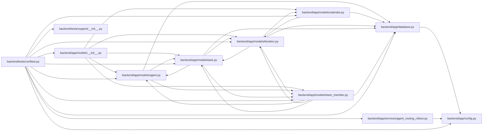

# conftest Module

**Path:** `backend/tests/conftest.py`

## Description

Shared isolated SQLite and PostgreSQL lifecycle fixtures.

## Imports

| Source | Symbols |
|--------|---------|
| `__future__` | `annotations` |
| `app` | `models` |
| `app.config` | `get_settings` |
| `app.database` | `Base` |
| `app.models.agent` | `AgentActor` |
| `app.models.calendar` | `Calendar` |
| `app.models.iteration` | `Iteration` |
| `app.models.task` | `Task` |
| `app.models.team_member` | `TeamMember`, `TeamMemberProfile` |
| `app.services.agent_routing_rollout` | `AgentRoutingTopologyReadiness`, `reset_agent_routing_topology_readiness`, `set_agent_routing_topology_readiness` |
| `collections.abc` | `AsyncIterator`, `Awaitable`, `Callable`, `Iterator` |
| `datetime` | `date` |
| `itertools` | `count` |
| `json` | `json` |
| `os` | `os` |
| `pathlib` | `Path` |
| `pytest` | `pytest` |
| `pytest_asyncio` | `pytest_asyncio` |
| `socket` | `socket` |
| `sqlalchemy` | `event` |
| `sqlalchemy.ext.asyncio` | `AsyncEngine`, `AsyncSession`, `async_sessionmaker`, `create_async_engine` |
| `tests.support` | `FailureInjector`, `FrozenClock`, `LegacySQLiteFactory`, `MappedModelFactory`, `PostgresTestDatabase`, `PostgresTestDatabaseManager` |
| `typing` | `Any` |

## Local dependency map

<!-- Auto-generated local dependency summary. Do not edit by hand. -->

### Internal neighbors

| Direction | Module |
|---|---|
| Outbound | [config](../modules/config.md) |
| Outbound | [app_database](../modules/app_database.md) |
| Outbound | [models___init__](../modules/models___init__.md) |
| Outbound | [models_agent](../modules/models_agent.md) |
| Outbound | [models_calendar](../modules/models_calendar.md) |
| Outbound | [models_iteration](../modules/models_iteration.md) |
| Outbound | [models_task](../modules/models_task.md) |
| Outbound | [team_member](../modules/team_member.md) |
| Outbound | [agent_routing_rollout](../modules/agent_routing_rollout.md) |
| Outbound | [support___init__](../modules/support___init__.md) |

### External packages

| Language | Used packages | Undeclared packages |
|---|---:|---:|
| python | 3 | 2 |

## Functions

| Function | Signature | Decorators | Description |
|----------|-----------|------------|-------------|
| `no_unapproved_network` | `(request: pytest.FixtureRequest, monkeypatch: pytest.MonkeyPatch) -> None` | `@pytest.fixture(autouse=True)` | Fail unit tests that accidentally cross a network boundary. |
| `qualified_model_aware_routing_test_context` | `(monkeypatch: pytest.MonkeyPatch) -> Iterator[None]` | `@pytest.fixture` | Run legacy routing suites behind an explicit server-owned test topology. |
| `mapped_model_factory` | `() -> MappedModelFactory` | `@pytest.fixture` | — |
| `legacy_sqlite_factory` | `() -> LegacySQLiteFactory` | `@pytest.fixture` | — |
| `frozen_clock` | `() -> FrozenClock` | `@pytest.fixture` | — |
| `failure_injector` | `() -> FailureInjector` | `@pytest.fixture` | — |
| `configure_database` | `(monkeypatch: pytest.MonkeyPatch)` | `@pytest.fixture` | Point shared database helpers at one test target and clear caches. |
| `sqlite_database_url` | `(tmp_path: Path) -> str` | `@pytest.fixture` | — |
| `sqlite_engine` | *(async)* `(sqlite_database_url: str) -> AsyncIterator[AsyncEngine]` | `@pytest_asyncio.fixture` | — |
| `db_session_factory` | *(async)* `(sqlite_engine: AsyncEngine) -> AsyncIterator[async_sessionmaker[AsyncSession]]` | `@pytest_asyncio.fixture` | Yield a factory so concurrency tests can open independent transactions. |
| `db_session` | *(async)* `(db_session_factory: async_sessionmaker[AsyncSession]) -> AsyncIterator[AsyncSession]` | `@pytest_asyncio.fixture` | — |
| `profile_factory` | *(async)* `(db_session: AsyncSession) -> AsyncIterator[Callable[..., Awaitable[TeamMemberProfile]]]` | `@pytest_asyncio.fixture` | Persist deterministic reusable routing profiles. |
| `actor_factory` | *(async)* `(db_session: AsyncSession) -> AsyncIterator[Callable[..., Awaitable[AgentActor]]]` | `@pytest_asyncio.fixture` | Persist deterministic actors with optional profile bindings. |
| `team_member_factory` | *(async)* `(db_session: AsyncSession) -> AsyncIterator[Callable[..., Awaitable[TeamMember]]]` | `@pytest_asyncio.fixture` | Persist deterministic capacity owners with optional profile/iteration links. |
| `task_factory` | *(async)* `(db_session: AsyncSession) -> AsyncIterator[Callable[..., Awaitable[Task]]]` | `@pytest_asyncio.fixture` | Persist deterministic tasks with an isolated valid calendar/iteration graph. |
| `postgres_database` | `() -> Iterator[PostgresTestDatabase]` | `@pytest.fixture` | — |
