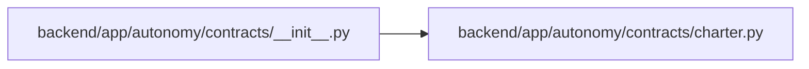

# __init__ Module

**Path:** `backend/app/autonomy/contracts/__init__.py`

## Description

Versioned autonomy contracts.

## Imports

| Source | Symbols |
|--------|---------|
| `app.autonomy.contracts.charter` | `AutonomyCharter`, `BootstrapActionManifest`, `CharterVerifier`, `SignedCharterVerificationReceipt`, `SignedAutonomyCharter`, `SignedBootstrapActionManifest`, `sign_charter_verification_receipt` |

## Local dependency map

<!-- Auto-generated local dependency summary. Do not edit by hand. -->

### Internal neighbors

| Direction | Module |
|---|---|
| Outbound | [charter](../modules/charter.md) |
