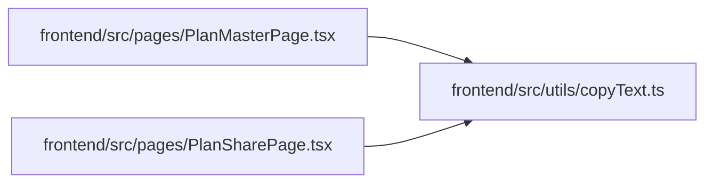

# copyText Module

**Path:** `frontend/src/utils/copyText.ts`

## Description

_Auto-generated from `frontend/src/utils/copyText.ts`._

## Module Signals

| Signal | Values |
|--------|--------|
| Exports | `copyText` |

## Local dependency map

<!-- Auto-generated local dependency summary. Do not edit by hand. -->

### Internal neighbors

| Direction | Module |
|---|---|
| Inbound | [PlanMasterPage](../modules/PlanMasterPage.md) |
| Inbound | [PlanSharePage](../modules/PlanSharePage.md) |

## Functions

| Function | Signature | Decorators | Description |
|----------|-----------|------------|-------------|
| `copyText` | *(async)* `(value: string) -> Promise<boolean>` | — | — |
