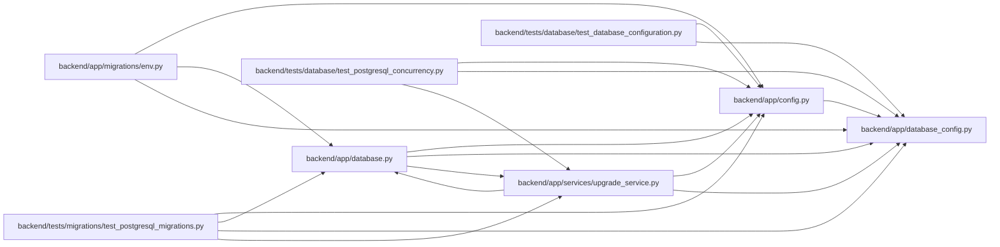

# database_config Module

**Path:** `backend/app/database_config.py`

## Description

Driver-neutral database URL, connection, and engine configuration.

## Imports

| Source | Symbols |
|--------|---------|
| `__future__` | `annotations` |
| `dataclasses` | `dataclass` |
| `pathlib` | `Path` |
| `re` | `re` |
| `sqlalchemy.engine` | `URL`, `make_url` |
| `typing` | `Any`, `Mapping` |

## Local dependency map

<!-- Auto-generated local dependency summary. Do not edit by hand. -->

### Internal neighbors

| Direction | Module |
|---|---|
| Inbound | [config](../modules/config.md) |
| Inbound | [app_database](../modules/app_database.md) |
| Inbound | [migrations_env](../modules/migrations_env.md) |
| Inbound | [upgrade_service](../modules/upgrade_service.md) |
| Inbound | [test_database_configuration](../modules/test_database_configuration.md) |
| Inbound | [test_postgresql_concurrency](../modules/test_postgresql_concurrency.md) |
| Inbound | [test_postgresql_migrations](../modules/test_postgresql_migrations.md) |

### External packages

| Language | Used packages | Undeclared packages |
|---|---:|---:|
| python | 1 | 0 |

## Classes

| Class | Line | Bases | Description |
|-------|------|-------|-------------|
| [DatabaseConfigurationError](../entities/DatabaseConfigurationError.md) | 39 | `ValueError` | Raised when database settings are unsupported or unsafe. |
| [DatabaseConfiguration](../entities/DatabaseConfiguration.md) | 44 | — | Validated, dialect-specific database configuration. |

## Functions

| Function | Signature | Decorators | Description |
|----------|-----------|------------|-------------|
| `_settings_value` | `(settings: Any, name: str) -> Any` | — | — |
| `_certificate_path` | `(value: str, *, setting_name: str) -> str` | — | — |
| `redact_database_url` | `(value: str \| URL) -> str` | — | Render a URL without exposing passwords or secret query values. |
| `alembic_safe_url` | `(value: str \| URL) -> str` | — | Render a URL for Alembic ConfigParser without percent interpolation. |
| `parse_database_configuration` | `(settings: Any) -> DatabaseConfiguration` | — | Validate settings and build driver-specific runtime/migration URLs. |
