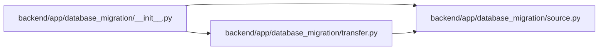

# __init__ Module

**Path:** `backend/app/database_migration/__init__.py`

## Description

Fail-closed SQLite-to-PostgreSQL migration tooling.

## Imports

| Source | Symbols |
|--------|---------|
| `app.database_migration.source` | `MigrationDataError`, `preflight_source` |
| `app.database_migration.transfer` | `load_snapshot`, `reconcile_snapshot` |

## Local dependency map

<!-- Auto-generated local dependency summary. Do not edit by hand. -->

### Internal neighbors

| Direction | Module |
|---|---|
| Outbound | [source](../modules/source.md) |
| Outbound | [transfer](../modules/transfer.md) |
