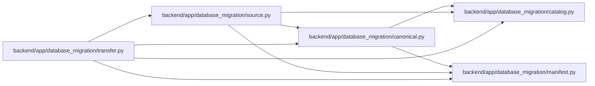

# canonical Module

**Path:** `backend/app/database_migration/canonical.py`

## Description

Cross-dialect value normalization and streaming table digests.

## Imports

| Source | Symbols |
|--------|---------|
| `__future__` | `annotations` |
| `app.database_migration.catalog` | `column_family` |
| `app.database_migration.manifest` | `canonical_json_bytes` |
| `base64` | `base64` |
| `datetime` | `UTC`, `date`, `datetime` |
| `decimal` | `Decimal` |
| `hashlib` | `hashlib` |
| `json` | `json` |
| `math` | `math` |
| `sqlalchemy.sql.schema` | `Column`, `Table` |
| `typing` | `Any`, `Iterable`, `Mapping` |

## Local dependency map

<!-- Auto-generated local dependency summary. Do not edit by hand. -->

### Internal neighbors

| Direction | Module |
|---|---|
| Inbound | [source](../modules/source.md) |
| Inbound | [transfer](../modules/transfer.md) |
| Outbound | [catalog](../modules/catalog.md) |
| Outbound | [database_migration_manifest](../modules/database_migration_manifest.md) |

### External packages

| Language | Used packages | Undeclared packages |
|---|---:|---:|
| python | 1 | 0 |

## Functions

| Function | Signature | Decorators | Description |
|----------|-----------|------------|-------------|
| `_datetime` | `(value: Any) -> datetime` | — | — |
| `_date` | `(value: Any) -> date` | — | — |
| `_json` | `(value: Any) -> Any` | — | — |
| `storage_value` | `(column: Column[object], value: Any) -> Any` | — | Convert a raw SQLite value to the target column's Python type. |
| `canonical_value` | `(column: Column[object], value: Any) -> Any` | — | Convert a value to its dialect-independent JSON representation. |
| `canonical_row` | `(table: Table, row: Mapping[str, Any]) -> list[Any]` | — | — |
| `row_sha256` | `(table: Table, row: Mapping[str, Any]) -> str` | — | — |
| `digest_rows` | `(table: Table, rows: Iterable[Mapping[str, Any]]) -> tuple[int, str]` | — | — |
