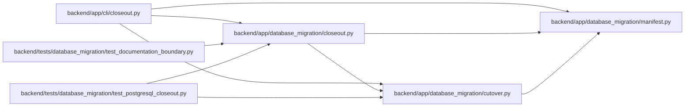

# closeout Module

**Path:** `backend/app/database_migration/closeout.py`

## Description

Validates and signs post-cutover publication against its production evidence chain and exact repository document hashes. The concise README supplies operator-guide links; capacity, authentication and production boundaries remain mandatory in the linked authoritative runbooks. This does not authorize a release or replace independent closeout.

## Imports

| Source | Symbols |
|--------|---------|
| `__future__` | `annotations` |
| `app.database_migration.cutover` | `CAPACITY_CLAIM`, `CutoverEvidenceError`, `_exact_keys`, `_read_json_object`, `_reject_secret_material`, `_release_identity`, `_sha256`, `_sign_document`, `_text`, `_time`, `_validate_production_report`, `_validate_qualification`, `verify_signed_document` |
| `app.database_migration.manifest` | `read_document`, `sha256_bytes` |
| `datetime` | `UTC`, `datetime`, `timedelta` |
| `importlib.metadata` | `PackageNotFoundError`, `version` |
| `ipaddress` | `ipaddress` |
| `json` | `json` |
| `os` | `os` |
| `pathlib` | `Path` |
| `re` | `re` |
| `tomllib` | `tomllib` |
| `typing` | `Any`, `Mapping` |
| `urllib.parse` | `urlsplit` |

## Local dependency map

<!-- Auto-generated local dependency summary. Do not edit by hand. -->

### Internal neighbors

| Direction | Module |
|---|---|
| Inbound | [cli_closeout](../modules/cli_closeout.md) |
| Inbound | [test_documentation_boundary](../modules/test_documentation_boundary.md) |
| Inbound | [test_postgresql_closeout](../modules/test_postgresql_closeout.md) |
| Outbound | [database_migration_cutover](../modules/database_migration_cutover.md) |
| Outbound | [database_migration_manifest](../modules/database_migration_manifest.md) |

## Classes

| Class | Line | Bases | Description |
|-------|------|-------|-------------|
| [CloseoutEvidenceError](../entities/CloseoutEvidenceError.md) | 149 | `CutoverEvidenceError` | A post-cutover publication or closure input is incomplete or unsafe. |

## Functions

| Function | Signature | Decorators | Description |
|----------|-----------|------------|-------------|
| `_optional_time` | `(value: object, *, field: str) -> datetime \| None` | — | — |
| `_optional_sha256` | `(value: object, *, field: str) -> str \| None` | — | — |
| `_number` | `(value: object, *, field: str) -> float` | — | — |
| `_integer` | `(value: object, *, field: str, minimum: int = 0) -> int` | — | — |
| `_safe_identifier` | `(value: object, *, field: str) -> str` | — | — |
| `_safe_public_uri` | `(value: object, *, field: str) -> str` | — | — |
| `_installed_application_version` | `() -> str` | — | — |
| `_repository_document_set` | `(repository_root: Path, *, expected_application_version: str) -> dict[str, dict[str, str]]` | — | — |
| `_artifact_references` | `(value: object, *, expected_qualification_sha256: str, expected_production_sha256: str) -> list[dict[str, str]]` | — | — |
| `_publication_exceptions` | `(value: object, *, published_at: datetime) -> list[dict[str, Any]]` | — | — |
| `_release_notes_markdown` | `(*, publication_id: str, published_at: datetime, application_version: str, postgresql_version: str, schema_head: str, release_boundary: str, release_identity: Mapping[str, Any], qualification: Mapping[str, Any], production: Mapping[str, Any], artifacts: list[dict[str, str]], exceptions: list[dict[str, Any]]) -> str` | — | — |
| `_validate_publication` | `(document: Mapping[str, Any], *, trusted_public_key: Path \| None, signed: bool) -> None` | — | — |
| `publish_postcutover_release` | `(*, input_path: Path, repository_root: Path, release_manifest_path: Path, qualification_report_path: Path, qualification_public_key: Path, production_cutover_path: Path, production_public_key: Path, signing_key: Path, signer: str, output_path: Path) -> dict[str, Any]` | — | Validate the production chain and sign its public release publication. |
| `_write_public_text` | `(path: Path, content: str) -> None` | — | — |
| `render_release_notes` | `(*, publication_path: Path, publication_public_key: Path, output_path: Path) -> str` | — | Verify a signed publication and materialize its immutable Markdown. |
| `_validate_evidence_matrix` | `(value: object, *, expected_ids: tuple[str, ...], allowed_statuses: frozenset[str], context: str, exceptions: Mapping[str, Mapping[str, Any]], audited_at: datetime, non_waivable: frozenset[str]) -> tuple[dict[str, dict[str, Any]], list[str]]` | — | — |
| `_validate_closeout_exceptions` | `(value: object, *, audited_at: datetime) -> tuple[dict[str, dict[str, Any]], list[str]]` | — | — |
| `_dependency_summary` | `(*, repository_root: Path \| None, release_manifest_path: Path \| None, qualification_report_path: Path \| None, qualification_public_key: Path \| None, production_cutover_path: Path \| None, production_public_key: Path \| None, publication_path: Path \| None, publication_public_key: Path \| None) -> dict[str, Any]` | — | — |
| `_validate_timed_status` | `(value: object, *, context: str, audited_at: datetime, production: Mapping[str, Any] \| None) -> tuple[dict[str, Any], list[str]]` | — | — |
| `_validate_postcutover_verification` | `(value: object, *, audited_at: datetime, production: Mapping[str, Any] \| None) -> tuple[dict[str, Any], list[str]]` | — | — |
| `_validate_backup_restore` | `(value: object, *, audited_at: datetime, production: Mapping[str, Any] \| None, schema_head: str \| None) -> tuple[dict[str, Any], list[str]]` | — | — |
| `_validate_operational_audit` | `(value: object, *, production_present: bool) -> tuple[dict[str, dict[str, Any]], list[str]]` | — | — |
| `_validate_availability` | `(value: object, *, audited_at: datetime, production: Mapping[str, Any] \| None) -> tuple[dict[str, Any], list[str], str]` | — | — |
| `_validate_sqlite_snapshot` | `(value: object, *, audited_at: datetime, production: Mapping[str, Any] \| None, stabilization: Mapping[str, Any]) -> tuple[dict[str, Any], list[str]]` | — | — |
| `_validate_dependency_summary` | `(value: Mapping[str, Any]) -> dict[str, Any]` | — | — |
| `_evaluate_closeout_input` | `(raw: Mapping[str, Any], *, dependencies: Mapping[str, Any]) -> tuple[dict[str, Any], list[str], str]` | — | — |
| `_validate_closure_decision` | `(document: Mapping[str, Any], *, trusted_public_key: Path) -> None` | — | — |
| `finalize_closeout` | `(*, input_path: Path, repository_root: Path \| None, release_manifest_path: Path \| None, qualification_report_path: Path \| None, qualification_public_key: Path \| None, production_cutover_path: Path \| None, production_public_key: Path \| None, publication_path: Path \| None, publication_public_key: Path \| None, signing_key: Path, signer: str, output_path: Path) -> dict[str, Any]` | — | Sign an independent verdict derived from complete closeout observations. |
| `verify_closeout_report` | `(*, report_path: Path, trusted_public_key: Path) -> str` | — | Verify a signed post-cutover publication or closure decision. |
