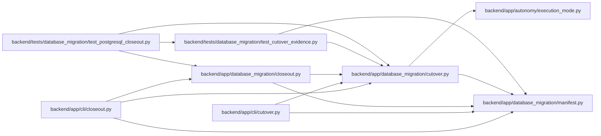

# cutover Module

**Path:** `backend/app/database_migration/cutover.py`

## Description

Signed, fail-closed evidence for PostgreSQL rehearsals and cutover.

The coordinator never performs a database or deployment mutation.  It turns
reviewed operator observations into immutable reports only after the complete
cutover contract has been satisfied.  Production automation can therefore use
the reports as gates without giving this module credentials or control-plane
access.

## Imports

| Source | Symbols |
|--------|---------|
| `__future__` | `annotations` |
| `app.autonomy.execution_mode` | `local_signing_rejection_message`, `zero_human_execution_enabled` |
| `app.database_migration.manifest` | `ManifestError`, `canonical_json_bytes`, `read_document`, `sha256_bytes`, `verify_document`, `write_document` |
| `base64` | `base64` |
| `cryptography.exceptions` | `InvalidSignature` |
| `cryptography.hazmat.primitives` | `serialization` |
| `cryptography.hazmat.primitives.asymmetric.ed25519` | `Ed25519PrivateKey`, `Ed25519PublicKey` |
| `datetime` | `UTC`, `datetime`, `timedelta` |
| `json` | `json` |
| `os` | `os` |
| `pathlib` | `Path` |
| `re` | `re` |
| `stat` | `stat` |
| `typing` | `Any`, `Mapping` |
| `urllib.parse` | `urlsplit` |

## Local dependency map

<!-- Auto-generated local dependency summary. Do not edit by hand. -->

### Internal neighbors

| Direction | Module |
|---|---|
| Inbound | [cli_closeout](../modules/cli_closeout.md) |
| Inbound | [cli_cutover](../modules/cli_cutover.md) |
| Inbound | [database_migration_closeout](../modules/database_migration_closeout.md) |
| Inbound | [test_cutover_evidence](../modules/test_cutover_evidence.md) |
| Inbound | [test_postgresql_closeout](../modules/test_postgresql_closeout.md) |
| Outbound | [execution_mode](../modules/execution_mode.md) |
| Outbound | [database_migration_manifest](../modules/database_migration_manifest.md) |

### External packages

| Language | Used packages | Undeclared packages |
|---|---:|---:|
| python | 1 | 0 |

## Classes

| Class | Line | Bases | Description |
|-------|------|-------|-------------|
| [CutoverEvidenceError](../entities/CutoverEvidenceError.md) | 142 | `ValueError` | A cutover input is unsafe, stale, incomplete, or internally inconsistent. |

## Functions

| Function | Signature | Decorators | Description |
|----------|-----------|------------|-------------|
| `_exact_keys` | `(value: Mapping[str, Any], required: set[str] \| frozenset[str], *, context: str, optional: set[str] \| frozenset[str] = frozenset()) -> None` | — | — |
| `_text` | `(value: object, *, field: str, minimum: int = 3) -> str` | — | — |
| `_sha256` | `(value: object, *, field: str) -> str` | — | — |
| `_time` | `(value: object, *, field: str) -> datetime` | — | — |
| `_number` | `(value: object, *, field: str) -> float` | — | — |
| `_require_new_output` | `(path: Path) -> None` | — | — |
| `_read_json_object` | `(path: Path) -> dict[str, Any]` | — | — |
| `_reject_secret_material` | `(value: object, *, path: str = '<root>') -> None` | — | — |
| `_private_key` | `(path: Path) -> Ed25519PrivateKey` | — | — |
| `_canonical_public_key` | `(value: bytes) -> tuple[Ed25519PublicKey, bytes]` | — | — |
| `_sign_document` | `(output: Path, payload: Mapping[str, Any], *, signing_key: Path, signer: str) -> dict[str, Any]` | — | — |
| `verify_signed_document` | `(document: Mapping[str, Any], *, trusted_public_key: Path, expected_kind: str \| None = None) -> str` | — | Verify the checksum, Ed25519 signature, and external trust-key pin. |
| `_release_identity` | `(release: Mapping[str, Any]) -> dict[str, Any]` | — | — |
| `_validate_release_reference` | `(reference: object, expected: Mapping[str, Any], *, context: str) -> dict[str, Any]` | — | — |
| `_validate_unbound_release_reference` | `(reference: object, *, context: str) -> dict[str, Any]` | — | — |
| `_validate_qualification` | `(document: Mapping[str, Any], *, release: Mapping[str, Any], trusted_public_key: Path) -> None` | — | — |
| `_validate_documentation` | `(document: Mapping[str, Any], *, expected_release: Mapping[str, Any] \| None, trusted_public_key: Path \| None, signed: bool) -> None` | — | — |
| `attest_documentation` | `(*, input_path: Path, release_manifest_path: Path, signing_key: Path, signer: str, output_path: Path) -> dict[str, Any]` | — | — |
| `_validate_source` | `(value: object, *, context: str) -> dict[str, Any]` | — | — |
| `_source_scope` | `(source: Mapping[str, Any]) -> dict[str, str]` | — | — |
| `_validate_source_scope` | `(value: object, *, context: str) -> dict[str, str]` | — | — |
| `_validate_target` | `(value: object, *, context: str) -> dict[str, Any]` | — | — |
| `_validate_operators` | `(value: object, *, context: str) -> dict[str, str]` | — | — |
| `_validate_execution` | `(document: Mapping[str, Any], *, sealed: bool) -> dict[str, Any]` | — | — |
| `seal_execution` | `(*, input_path: Path, output_path: Path) -> dict[str, Any]` | — | — |
| `_cross_validate_dependencies` | `(execution: Mapping[str, Any], *, release_identity: Mapping[str, Any], qualification: Mapping[str, Any], documentation: Mapping[str, Any]) -> None` | — | — |
| `_rehearsal_payload` | `(execution: Mapping[str, Any]) -> dict[str, Any]` | — | — |
| `finalize_rehearsal` | `(*, execution_path: Path, release_manifest_path: Path, qualification_report_path: Path, qualification_public_key: Path, documentation_walkthrough_path: Path, documentation_public_key: Path, signing_key: Path, signer: str, output_path: Path) -> dict[str, Any]` | — | — |
| `_validate_rehearsal_report` | `(document: Mapping[str, Any], *, trusted_public_key: Path) -> dict[str, Any]` | — | — |
| `finalize_rehearsal_series` | `(*, abort_report_path: Path, rehearsal_report_paths: list[Path], rehearsal_public_key: Path, signing_key: Path, signer: str, output_path: Path) -> dict[str, Any]` | — | — |
| `_validate_rehearsal_series` | `(document: Mapping[str, Any], *, trusted_public_key: Path) -> None` | — | — |
| `_validate_authorization` | `(document: Mapping[str, Any], *, trusted_public_key: Path \| None, signed: bool) -> None` | — | — |
| `authorize_production` | `(*, intent_path: Path, release_manifest_path: Path, qualification_report_path: Path, qualification_public_key: Path, documentation_walkthrough_path: Path, documentation_public_key: Path, rehearsal_series_path: Path, rehearsal_public_key: Path, signing_key: Path, signer: str, output_path: Path) -> dict[str, Any]` | — | — |
| `finalize_production` | `(*, execution_path: Path, release_manifest_path: Path, qualification_report_path: Path, qualification_public_key: Path, documentation_walkthrough_path: Path, documentation_public_key: Path, rehearsal_series_path: Path, rehearsal_public_key: Path, authorization_path: Path, authorization_public_key: Path, signing_key: Path, signer: str, output_path: Path) -> dict[str, Any]` | — | — |
| `_validate_production_report` | `(document: Mapping[str, Any], *, trusted_public_key: Path) -> None` | — | — |
| `verify_report` | `(*, report_path: Path, trusted_public_key: Path) -> str` | — | — |
