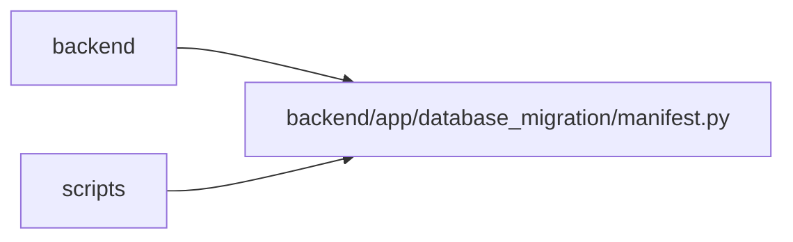

# manifest Module

**Path:** `backend/app/database_migration/manifest.py`

## Description

Deterministic, checksummed, secret-free operational documents.

## Imports

| Source | Symbols |
|--------|---------|
| `__future__` | `annotations` |
| `hashlib` | `hashlib` |
| `json` | `json` |
| `os` | `os` |
| `pathlib` | `Path` |
| `typing` | `Any`, `Mapping` |

## Local dependency map

<!-- Auto-generated local dependency summary. Do not edit by hand. -->

> Module-level dependencies exceed the generated-diagram limits, so the diagram and table below group them by top-level package. Counts report the number of module neighbors in each package.

### Internal neighbors

| Direction | Module |
|---|---|
| Inbound | `backend` (11) |
| Inbound | `scripts` (1) |

> All 12 module neighbor(s) are summarized by package because the module-level view exceeds the 12-node limit.

## Classes

| Class | Line | Bases | Description |
|-------|------|-------|-------------|
| [ManifestError](../entities/ManifestError.md) | 15 | `ValueError` | A migration document is malformed or has lost integrity. |

## Functions

| Function | Signature | Decorators | Description |
|----------|-----------|------------|-------------|
| `canonical_json_bytes` | `(value: Any) -> bytes` | — | Encode JSON deterministically without ASCII-destroying Unicode. |
| `sha256_bytes` | `(value: bytes) -> str` | — | — |
| `seal_document` | `(payload: Mapping[str, Any]) -> dict[str, Any]` | — | Return a shallow copy carrying a checksum over every other field. |
| `verify_document` | `(document: Mapping[str, Any]) -> str` | — | Verify and return the document checksum. |
| `read_document` | `(path: Path) -> dict[str, Any]` | — | Read one checksummed JSON object from disk. |
| `write_document` | `(path: Path, payload: Mapping[str, Any]) -> dict[str, Any]` | — | Atomically write a checksummed JSON document and fsync its directory. |
