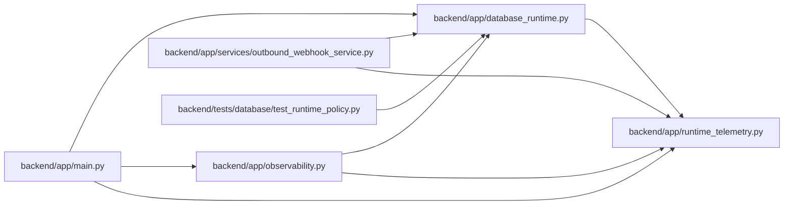

# database_runtime Module

**Path:** `backend/app/database_runtime.py`

## Description

PostgreSQL error classification and bounded transaction retry policy.

## Imports

| Source | Symbols |
|--------|---------|
| `__future__` | `annotations` |
| `app.runtime_telemetry` | `correlation_id_context`, `metrics` |
| `asyncio` | `asyncio` |
| `collections.abc` | `Awaitable`, `Callable` |
| `dataclasses` | `dataclass` |
| `enum` | `Enum` |
| `logging` | `logging` |
| `random` | `random` |
| `sqlalchemy.exc` | `DBAPIError` |
| `time` | `monotonic` |
| `typing` | `TypeVar` |

## Local dependency map

<!-- Auto-generated local dependency summary. Do not edit by hand. -->

### Internal neighbors

| Direction | Module |
|---|---|
| Inbound | [app_main](../modules/app_main.md) |
| Inbound | [observability](../modules/observability.md) |
| Inbound | [outbound_webhook_service](../modules/outbound_webhook_service.md) |
| Inbound | [test_runtime_policy](../modules/test_runtime_policy.md) |
| Outbound | [runtime_telemetry](../modules/runtime_telemetry.md) |

### External packages

| Language | Used packages | Undeclared packages |
|---|---:|---:|
| python | 1 | 0 |

## Classes

| Class | Kind | Line | Bases / Target | Description |
|-------|------|------|----------------|-------------|
| [DatabaseFailureKind](../entities/DatabaseFailureKind.md) | Enum | 40 | `str`, `Enum` | — |
| [DatabaseConflictError](../entities/DatabaseConflictError.md) | Class | 46 | `RuntimeError` | A safe mutation exhausted serialization/deadlock retries. |
| [DatabaseUnavailableError](../entities/DatabaseUnavailableError.md) | Class | 50 | `RuntimeError` | A retryable database availability failure exhausted its budget. |
| [DatabaseRetryPolicy](../entities/DatabaseRetryPolicy.md) | Class | 55 | — | A short retry budget that cannot outlive the request deadline. |

## Functions

| Function | Signature | Decorators | Description |
|----------|-----------|------------|-------------|
| `sqlstate_from_exception` | `(exc: BaseException) -> str \| None` | — | Extract a Psycopg/DBAPI SQLSTATE without relying on message text. |
| `classify_database_failure` | `(exc: BaseException) -> DatabaseFailureKind \| None` | — | Classify only explicit PostgreSQL transient states. |
| `_exhausted_error` | `(kind: DatabaseFailureKind) -> RuntimeError` | — | — |
| `run_database_retry` | *(async)* `(operation: Callable[[int], Awaitable[T]], *, operation_name: str, safe_to_retry: bool, rollback: Callable[[], Awaitable[object]] \| None = None, policy: DatabaseRetryPolicy = DatabaseRetryPolicy(), sleep: Callable[[float], Awaitable[object]] = asyncio.sleep, random_value: Callable[[], float] = random.random) -> T` | — | Run one complete transaction boundary with a bounded replay policy. |
