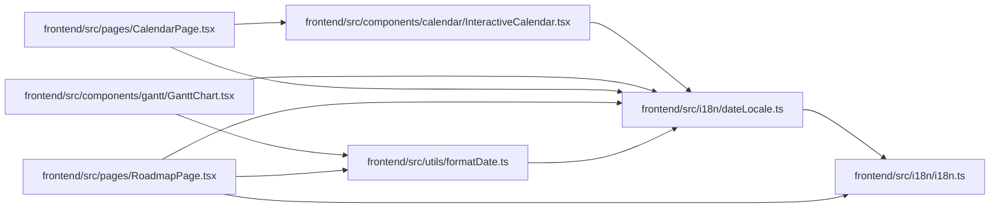

# dateLocale Module

**Path:** `frontend/src/i18n/dateLocale.ts`

## Description

_Auto-generated from `frontend/src/i18n/dateLocale.ts`._

## Imports

| Source | Symbols |
|--------|---------|
| `./i18n` | `i18n` |
| `date-fns` | `Locale` |
| `date-fns/locale` | `enUS`, `ru` |

## Module Signals

| Signal | Values |
|--------|--------|
| Exports | `dateFnsLocale`, `normalizedLanguage` |

## Local dependency map

<!-- Auto-generated local dependency summary. Do not edit by hand. -->

### Internal neighbors

| Direction | Module |
|---|---|
| Inbound | [InteractiveCalendar](../modules/InteractiveCalendar.md) |
| Inbound | [GanttChart](../modules/GanttChart.md) |
| Inbound | [CalendarPage](../modules/CalendarPage.md) |
| Inbound | [RoadmapPage](../modules/RoadmapPage.md) |
| Inbound | [formatDate](../modules/formatDate.md) |
| Outbound | [i18n](../modules/i18n.md) |

### External packages

| Language | Used packages | Undeclared packages |
|---|---:|---:|
| typescript | 1 | 0 |

## Functions

| Function | Signature | Decorators | Description |
|----------|-----------|------------|-------------|
| `normalizedLanguage` | `(language = i18n.language)` | — | — |
| `dateFnsLocale` | `(language = i18n.language) -> Locale` | — | — |
