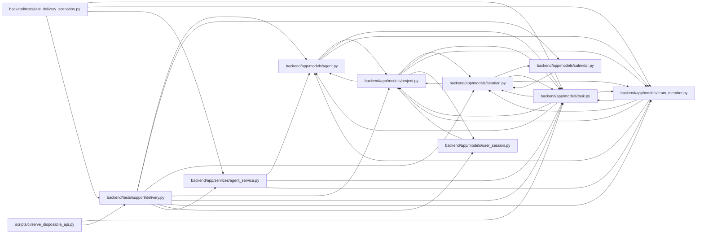

# delivery Module

**Path:** `backend/tests/support/delivery.py`

## Description

Deterministic shared delivery graph for database and HTTP scenarios.

## Imports

| Source | Symbols |
|--------|---------|
| `app.models.agent` | `AgentActor` |
| `app.models.calendar` | `Calendar` |
| `app.models.iteration` | `Iteration` |
| `app.models.project` | `Project` |
| `app.models.task` | `Task` |
| `app.models.team_member` | `TeamMember`, `TeamMemberProfile` |
| `app.models.user_session` | `UserSession` |
| `app.services.agent_service` | `hash_api_key` |
| `dataclasses` | `dataclass` |
| `datetime` | `date` |
| `sqlalchemy.ext.asyncio` | `AsyncSession` |

## Local dependency map

<!-- Auto-generated local dependency summary. Do not edit by hand. -->

### Internal neighbors

| Direction | Module |
|---|---|
| Inbound | [test_delivery_scenarios](../modules/test_delivery_scenarios.md) |
| Inbound | [serve_disposable_api](../modules/serve_disposable_api.md) |
| Outbound | [models_agent](../modules/models_agent.md) |
| Outbound | [models_calendar](../modules/models_calendar.md) |
| Outbound | [models_iteration](../modules/models_iteration.md) |
| Outbound | [models_project](../modules/models_project.md) |
| Outbound | [models_task](../modules/models_task.md) |
| Outbound | [team_member](../modules/team_member.md) |
| Outbound | [user_session](../modules/user_session.md) |
| Outbound | [agent_service](../modules/agent_service.md) |

### External packages

| Language | Used packages | Undeclared packages |
|---|---:|---:|
| python | 1 | 0 |

## Classes

| Class | Line | Bases | Description |
|-------|------|-------|-------------|
| [DeliveryScenario](../entities/DeliveryScenario.md) | 19 | — | — |

## Functions

| Function | Signature | Decorators | Description |
|----------|-----------|------------|-------------|
| `seed_delivery_scenario` | *(async)* `(db: AsyncSession) -> DeliveryScenario` | — | — |
