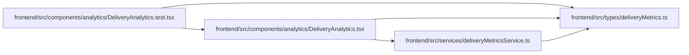

# deliveryMetrics Module

**Path:** `frontend/src/types/deliveryMetrics.ts`

## Description

_Auto-generated from `frontend/src/types/deliveryMetrics.ts`._

## Module Signals

| Signal | Values |
|--------|--------|
| Exports | `DeliveryMetrics`, `DeliveryQueueItem`, `DurationSamples` |

## Local dependency map

<!-- Auto-generated local dependency summary. Do not edit by hand. -->

### Internal neighbors

| Direction | Module |
|---|---|
| Inbound | [DeliveryAnalytics.test](../modules/DeliveryAnalytics.test.md) |
| Inbound | [DeliveryAnalytics](../modules/DeliveryAnalytics.md) |
| Inbound | [deliveryMetricsService](../modules/deliveryMetricsService.md) |

## Classes

| Class | Kind | Line | Bases / Target | Description |
|-------|------|------|----------------|-------------|
| [DurationSamples](../entities/deliveryMetrics_DurationSamples.md) | Class | 1 | — | — |
| [DeliveryQueueItem](../entities/deliveryMetrics_DeliveryQueueItem.md) | Class | 10 | — | — |
| [DeliveryMetrics](../entities/DeliveryMetrics.md) | Class | 17 | — | — |
