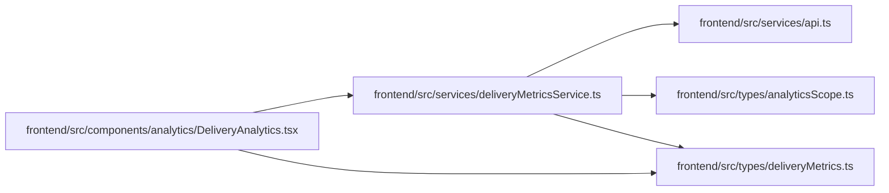

# deliveryMetricsService Module

**Path:** `frontend/src/services/deliveryMetricsService.ts`

## Description

_Auto-generated from `frontend/src/services/deliveryMetricsService.ts`._

## Imports

| Source | Symbols | Type-only | Runtime emission |
|--------|---------|-----------|------------------|
| `../types/analyticsScope` | `AnalyticsScope` | Declaration | erased |
| `../types/deliveryMetrics` | `DeliveryMetrics` | Declaration | erased |
| `./api` | `api` | — | compiler-dependent |

## Module Signals

| Signal | Values |
|--------|--------|
| Exports | `deliveryMetricsService` |
| Constants | `deliveryMetricsService` |

## Local dependency map

<!-- Auto-generated local dependency summary. Do not edit by hand. -->
This graph shows full source coupling. Type dependencies can be erased; compiler-dependent cycle groups are runtime candidates, not confirmed initialization cycles.

```mermaid
flowchart LR
    n0["frontend/src/components/analytics/DeliveryAnalytics.tsx"]
    n1["frontend/src/services/api.ts"]
    n2["frontend/src/services/deliveryMetricsService.ts"]
    n3["frontend/src/types/analyticsScope.ts"]
    n4["frontend/src/types/deliveryMetrics.ts"]
    n0 --> n2
    n0 --> n4
    n2 --> n1
    n2 --> n3
    n2 --> n4
    click n0 "../modules/DeliveryAnalytics.md"
    click n1 "../modules/api.md"
    click n2 "../modules/deliveryMetricsService.md"
    click n3 "../modules/analyticsScope.md"
    click n4 "../modules/deliveryMetrics.md"
```

### Internal neighbors

| Direction | Module |
|---|---|
| Inbound | [DeliveryAnalytics](../modules/DeliveryAnalytics.md) |
| Outbound | [api](../modules/api.md) |
| Outbound | [analyticsScope](../modules/analyticsScope.md) |
| Outbound | [deliveryMetrics](../modules/deliveryMetrics.md) |
