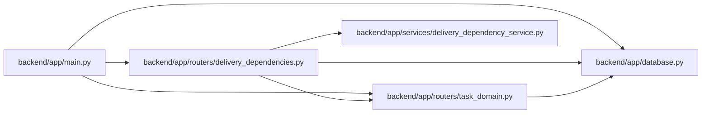

# delivery_dependencies Module

**Path:** `backend/app/routers/delivery_dependencies.py`

## Description

Versioned delivery prerequisite commands.

## Imports

| Source | Symbols |
|--------|---------|
| `app.database` | `get_db` |
| `app.routers.task_domain` | `domain_result` |
| `app.services.delivery_dependency_service` | `DeliveryDependencyService` |
| `fastapi` | `APIRouter`, `Depends`, `Query` |
| `pydantic` | `BaseModel`, `Field` |
| `sqlalchemy.ext.asyncio` | `AsyncSession` |
| `typing` | `Annotated`, `Literal` |

## Local dependency map

<!-- Auto-generated local dependency summary. Do not edit by hand. -->

### Internal neighbors

| Direction | Module |
|---|---|
| Inbound | [app_main](../modules/app_main.md) |
| Outbound | [app_database](../modules/app_database.md) |
| Outbound | [routers_task_domain](../modules/routers_task_domain.md) |
| Outbound | [delivery_dependency_service](../modules/delivery_dependency_service.md) |

### External packages

| Language | Used packages | Undeclared packages |
|---|---:|---:|
| python | 3 | 0 |

## Classes

| Class | Kind | Line | Bases / Target | Description |
|-------|------|------|----------------|-------------|
| [DeliveryDatabase](../entities/DeliveryDatabase.md) | Type alias | 14 | `Annotated[AsyncSession, Depends(get_db, scope='function')]` | — |
| [DeliveryDependencyInput](../entities/DeliveryDependencyInput.md) | Pydantic model | 17 | `BaseModel` | — |

## Functions

| Function | Signature | Decorators | Description |
|----------|-----------|------------|-------------|
| `list_delivery_dependencies` | *(async)* `(task_id: int, db: DeliveryDatabase)` | `@router.get('/tasks/{task_id}/delivery-dependencies')` | — |
| `add_delivery_dependency` | *(async)* `(task_id: int, data: DeliveryDependencyInput, db: DeliveryDatabase)` | `@router.post('/tasks/{task_id}/delivery-dependencies')` | — |
| `remove_delivery_dependency` | *(async)* `(task_id: int, edge_id: int, db: DeliveryDatabase, expected_version: int = Query(gt=0))` | `@router.delete('/tasks/{task_id}/delivery-dependencies/{edge_id}')` | — |
