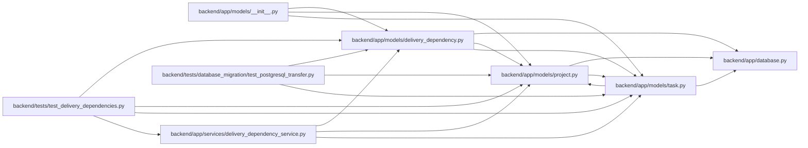

# delivery_dependency Module

**Path:** `backend/app/models/delivery_dependency.py`

## Description

Persists exactly one task or milestone prerequisite per delivery edge. Foreign-key restrictions protect referenced targets. Flush hooks collect relevant changes for the owning command’s global cycle validation and downstream invalidation; they do not independently commit.

## Imports

| Source | Symbols |
|--------|---------|
| `app.database` | `Base` |
| `app.models.project` | `ProjectMilestone` |
| `app.models.task` | `Task`, `TaskDependency` |
| `sqlalchemy` | `CheckConstraint`, `ForeignKey`, `Integer`, `UniqueConstraint`, `event`, `inspect` |
| `sqlalchemy.orm` | `Mapped`, `Session`, `mapped_column` |

## Local dependency map

<!-- Auto-generated local dependency summary. Do not edit by hand. -->

### Internal neighbors

| Direction | Module |
|---|---|
| Inbound | [models___init__](../modules/models___init__.md) |
| Inbound | [delivery_dependency_service](../modules/delivery_dependency_service.md) |
| Inbound | [test_postgresql_transfer](../modules/test_postgresql_transfer.md) |
| Inbound | [test_delivery_dependencies](../modules/test_delivery_dependencies.md) |
| Outbound | [app_database](../modules/app_database.md) |
| Outbound | [models_project](../modules/models_project.md) |
| Outbound | [models_task](../modules/models_task.md) |

### External packages

| Language | Used packages | Undeclared packages |
|---|---:|---:|
| python | 1 | 0 |

## Classes

| Class | Line | Bases | Description |
|-------|------|-------|-------------|
| [DeliveryDependency](../entities/DeliveryDependency.md) | 9 | `Base` | — |

## Functions

| Function | Signature | Decorators | Description |
|----------|-----------|------------|-------------|
| `track_delivery_changes` | `(session, _flush_context, _instances)` | `@event.listens_for(Session, 'before_flush')` | Collect changes for transactional downstream invalidation without rewriting history. |
