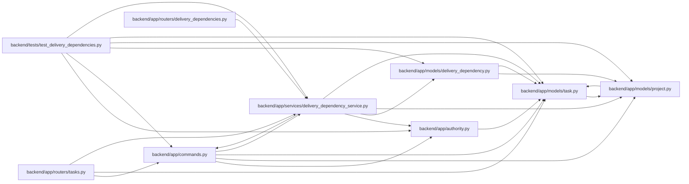

# delivery_dependency_service Module

**Path:** `backend/app/services/delivery_dependency_service.py`

## Description

Owns typed task/milestone delivery prerequisites, distinct from local schedule dependencies. Creation checks both endpoint visibility and global cycles across hierarchy, milestone and dependency edges. Readiness requires current attributed acceptance; inaccessible targets expose only a generic blocker. Changes propagate version and evidence invalidation transactionally, while deletion and project changes require explicit link resolution.

## Imports

| Source | Symbols |
|--------|---------|
| `app.authority` | `AuthorityError`, `internal_authority`, `require_project` |
| `app.commands` | `PlanningConflict`, `atomic_command`, `lock_planning` |
| `app.models.delivery_dependency` | `DeliveryDependency` |
| `app.models.project` | `ProjectMilestone` |
| `app.models.task` | `Task`, `TaskDependency` |
| `collections` | `defaultdict`, `deque` |
| `sqlalchemy` | `or_`, `select` |

## Local dependency map

<!-- Auto-generated local dependency summary. Do not edit by hand. -->

### Internal neighbors

| Direction | Module |
|---|---|
| Inbound | [commands](../modules/commands.md) |
| Inbound | [delivery_dependencies](../modules/delivery_dependencies.md) |
| Inbound | [tasks](../modules/tasks.md) |
| Inbound | [test_delivery_dependencies](../modules/test_delivery_dependencies.md) |
| Outbound | [authority](../modules/authority.md) |
| Outbound | [commands](../modules/commands.md) |
| Outbound | [delivery_dependency](../modules/delivery_dependency.md) |
| Outbound | [models_project](../modules/models_project.md) |
| Outbound | [models_task](../modules/models_task.md) |

### External packages

| Language | Used packages | Undeclared packages |
|---|---:|---:|
| python | 1 | 0 |

## Classes

| Class | Line | Bases | Description |
|-------|------|-------|-------------|
| [DeliveryDependencyService](../entities/DeliveryDependencyService.md) | 14 | — | — |
