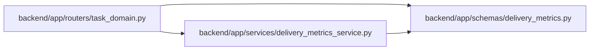

# delivery_metrics Module

**Path:** `backend/app/schemas/delivery_metrics.py`

## Description

The response separates event-window outcomes, elapsed duration samples, historical coverage and bounded current queues. Unknown duration values are nullable and measured zero remains zero. Scope is the project/iteration recorded with the fact, preserving historical attribution across later hierarchy and scope changes.

Delivery duration samples and queues with explicit observation coverage.

## Imports

| Source | Symbols |
|--------|---------|
| `datetime` | `datetime` |
| `pydantic` | `BaseModel`, `Field` |

## Local dependency map

<!-- Auto-generated local dependency summary. Do not edit by hand. -->

### Internal neighbors

| Direction | Module |
|---|---|
| Inbound | [routers_task_domain](../modules/routers_task_domain.md) |
| Inbound | [delivery_metrics_service](../modules/delivery_metrics_service.md) |

### External packages

| Language | Used packages | Undeclared packages |
|---|---:|---:|
| python | 1 | 0 |

## Classes

| Class | Line | Bases | Description |
|-------|------|-------|-------------|
| [DurationSamples](../entities/delivery_metrics_DurationSamples.md) | 7 | `BaseModel` | — |
| [DeliveryQueueItem](../entities/delivery_metrics_DeliveryQueueItem.md) | 16 | `BaseModel` | — |
| [DeliveryMetricsResponse](../entities/DeliveryMetricsResponse.md) | 23 | `BaseModel` | — |
