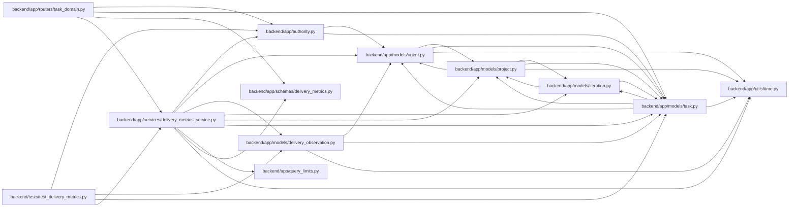

# delivery_metrics_service Module

**Path:** `backend/app/services/delivery_metrics_service.py`

## Description

Permission-scoped reports aggregate immutable observations within a declared elapsed-time window. Accepted delivery counts use distinct task identities, with acceptance/rejection/reopen events reported separately. Each duration has its own sample, missing-start and incomplete-episode counts; missing history is never reconstructed from status dates. Bounded current review/recovery queues recheck task visibility and expose unknown ages explicitly.

Event-based scoped delivery metrics; status dates never supply missing instants.

## Imports

| Source | Symbols |
|--------|---------|
| `app.authority` | `internal_authority`, `require_project` |
| `app.models.agent` | `AgentRun` |
| `app.models.delivery_observation` | `DeliveryObservation` |
| `app.models.iteration` | `Iteration` |
| `app.models.project` | `Project` |
| `app.models.task` | `Task` |
| `app.query_limits` | `CollectionLimitExceededError`, `MAX_PROJECT_TREE_TASKS` |
| `app.schemas.delivery_metrics` | `DeliveryMetricsResponse`, `DeliveryQueueItem`, `DurationSamples` |
| `app.utils.time` | `as_utc`, `utc_now` |
| `collections` | `defaultdict` |
| `datetime` | `timedelta` |
| `sqlalchemy` | `select` |
| `statistics` | `mean`, `median` |

## Local dependency map

<!-- Auto-generated local dependency summary. Do not edit by hand. -->

### Internal neighbors

| Direction | Module |
|---|---|
| Inbound | [routers_task_domain](../modules/routers_task_domain.md) |
| Inbound | [test_delivery_metrics](../modules/test_delivery_metrics.md) |
| Outbound | [authority](../modules/authority.md) |
| Outbound | [models_agent](../modules/models_agent.md) |
| Outbound | [delivery_observation](../modules/delivery_observation.md) |
| Outbound | [models_iteration](../modules/models_iteration.md) |
| Outbound | [models_project](../modules/models_project.md) |
| Outbound | [models_task](../modules/models_task.md) |
| Outbound | [query_limits](../modules/query_limits.md) |
| Outbound | [delivery_metrics](../modules/delivery_metrics.md) |
| Outbound | [time](../modules/time.md) |

### External packages

| Language | Used packages | Undeclared packages |
|---|---:|---:|
| python | 1 | 0 |

## Classes

| Class | Line | Bases | Description |
|-------|------|-------|-------------|
| [DeliveryMetricsService](../entities/DeliveryMetricsService.md) | 100 | — | — |

## Functions

| Function | Signature | Decorators | Description |
|----------|-----------|------------|-------------|
| `_samples` | `(values, *, censored = 0, unknown = 0)` | — | — |
| `summarize_observations` | `(rows, start, end)` | — | Use immutable leaf facts, keeping reopened episodes and incomplete histories visible. |