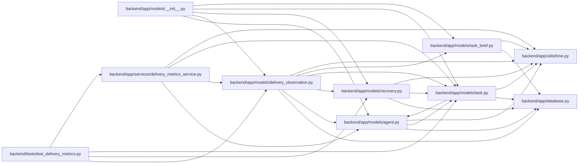

# delivery_observation Module

**Path:** `backend/app/models/delivery_observation.py`

## Description

Delivery facts are appended inside the owning database transaction, with task identity, version and scope captured at the event boundary. Leaf checks exclude structural parents. Acceptance requires matching task, brief and artifact revisions plus a recorded principal. Grouping and removal end incomplete episodes without rewriting accepted facts; restored identities do not invent original capture dates. Nullable scope references detach on resource deletion while original identifiers remain historical evidence.

Immutable workflow observations with scope captured at the event boundary.

## Imports

| Source | Symbols |
|--------|---------|
| `app.database` | `Base` |
| `app.models.agent` | `TaskEvent` |
| `app.models.recovery` | `TaskDeletionFence` |
| `app.models.task` | `Task` |
| `app.models.task_brief` | `TaskReviewRecord` |
| `app.utils.time` | `UTCDateTime`, `utc_now` |
| `datetime` | `datetime` |
| `json` | `json` |
| `sqlalchemy` | `CheckConstraint`, `ForeignKey`, `Index`, `Integer`, `String`, `UniqueConstraint`, `event`, `select` |
| `sqlalchemy.dialects.postgresql` | `insert` |
| `sqlalchemy.dialects.sqlite` | `insert` |
| `sqlalchemy.orm` | `Mapped`, `mapped_column` |

## Local dependency map

<!-- Auto-generated local dependency summary. Do not edit by hand. -->

### Internal neighbors

| Direction | Module |
|---|---|
| Inbound | [models___init__](../modules/models___init__.md) |
| Inbound | [delivery_metrics_service](../modules/delivery_metrics_service.md) |
| Inbound | [test_delivery_metrics](../modules/test_delivery_metrics.md) |
| Outbound | [app_database](../modules/app_database.md) |
| Outbound | [models_agent](../modules/models_agent.md) |
| Outbound | [recovery](../modules/recovery.md) |
| Outbound | [models_task](../modules/models_task.md) |
| Outbound | [models_task_brief](../modules/models_task_brief.md) |
| Outbound | [time](../modules/time.md) |

### External packages

| Language | Used packages | Undeclared packages |
|---|---:|---:|
| python | 1 | 0 |

## Classes

| Class | Line | Bases | Description |
|-------|------|-------|-------------|
| [DeliveryObservation](../entities/DeliveryObservation.md) | 16 | `Base` | Retain delivery identity and scope independently of later hierarchy edits. |

## Functions

| Function | Signature | Decorators | Description |
|----------|-----------|------------|-------------|
| `_record` | `(connection, row, kind, at, source, *, version = None, structural = False)` | — | Join the owning transaction without exposing a client-authored ledger write. |
| `_task_row` | `(connection, task_id)` | — | — |
| `observe_task_insert` | `(_mapper, connection, task)` | — | — |
| `observe_task_event` | `(_mapper, connection, item)` | — | — |
| `observe_review` | `(_mapper, connection, review)` | — | — |
| `observe_task_update` | `(_mapper, connection, task)` | — | — |
| `observe_task_delete` | `(_mapper, connection, task)` | — | — |
| `immutable_observation` | `(*_args)` | — | — |