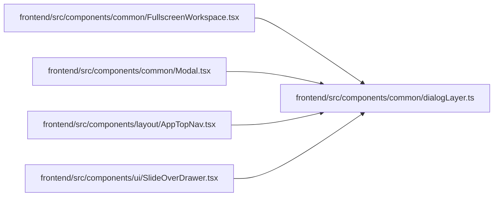

# dialogLayer Module

**Path:** `frontend/src/components/common/dialogLayer.ts`

## Description

_Auto-generated from `frontend/src/components/common/dialogLayer.ts`._

## Imports

| Source | Symbols |
|--------|---------|
| `react` | `useCallback`, `useEffect`, `useRef`, `RefObject` |

## Module Signals

| Signal | Values |
|--------|--------|
| Exports | `useDialogLayer` |
| Constants | `focusableSelector`, `dialogLayerStack` |
| Module calls | `focusableSelector = join` |

## Local dependency map

<!-- Auto-generated local dependency summary. Do not edit by hand. -->

### Internal neighbors

| Direction | Module |
|---|---|
| Inbound | [FullscreenWorkspace](../modules/FullscreenWorkspace.md) |
| Inbound | [Modal](../modules/Modal.md) |
| Inbound | [AppTopNav](../modules/AppTopNav.md) |
| Inbound | [SlideOverDrawer](../modules/SlideOverDrawer.md) |

### External packages

| Language | Used packages | Undeclared packages |
|---|---:|---:|
| typescript | 1 | 0 |

## Classes

| Class | Kind | Line | Bases / Target | Description |
|-------|------|------|----------------|-------------|
| [DialogLayerOptions](../entities/DialogLayerOptions.md) | Class | 57 | — | — |

## Functions

| Function | Signature | Decorators | Description |
|----------|-----------|------------|-------------|
| `useDialogLayer` | `({     open,     onClose,     initialFocusRef,     restoreFocusRef,     closeDisabled = false, }: DialogLayerOptions)` | — | Share modal-layer behavior without coupling a dialog to a visual layout. |
