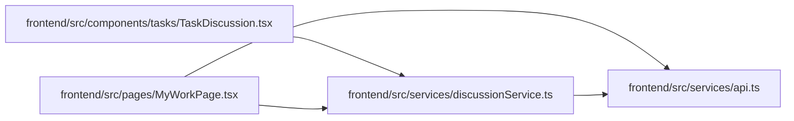

# discussionService Module

**Path:** `frontend/src/services/discussionService.ts`

## Description

Typed browser client for comment revisions, mentions, subscriptions, personal inbox state and delivery retry. It carries expected comment/subscription versions and leaves task execution commands to the separate task service.

## Imports

| Source | Symbols |
|--------|---------|
| `./api` | `api` |

## Module Signals

| Signal | Values |
|--------|--------|
| Exports | `CommentRevision`, `InboxItem`, `NotificationDelivery`, `Page`, `Subscription`, `TaskComment`, `discussionService` |
| Constants | `discussionService` |

## Local dependency map

<!-- Auto-generated local dependency summary. Do not edit by hand. -->

### Internal neighbors

| Direction | Module |
|---|---|
| Inbound | [TaskDiscussion](../modules/TaskDiscussion.md) |
| Inbound | [MyWorkPage](../modules/MyWorkPage.md) |
| Outbound | [api](../modules/api.md) |

## Classes

| Class | Kind | Line | Bases / Target | Description |
|-------|------|------|----------------|-------------|
| [TaskComment](../entities/discussionService_TaskComment.md) | Class | 3 | — | — |
| [CommentRevision](../entities/CommentRevision.md) | Class | 8 | — | — |
| [Subscription](../entities/Subscription.md) | Class | 9 | — | — |
| [InboxItem](../entities/InboxItem.md) | Class | 10 | — | — |
| [NotificationDelivery](../entities/NotificationDelivery.md) | Class | 11 | — | — |
| [Page](../entities/Page.md) | Class | 12 | — | — |
