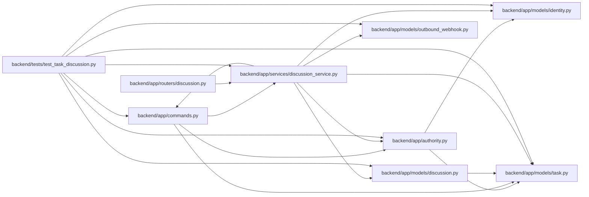

# discussion_service Module

**Path:** `backend/app/services/discussion_service.py`

## Description

Owns bounded human discussion, validated mentions, subscriptions and personal inbox projections. Comment edits use their own versions and retained revision history, without changing task execution evidence or planning revisions. Writes recheck task scope after locking. Worker intents are idempotent per event/recipient and dispatch rechecks live access and preferences; suppression terminates without claiming delivery. Inbox reads and read-state changes remain personal and task-scoped.

## Imports

| Source | Symbols |
|--------|---------|
| `app.authority` | `AuthorityError`, `internal_authority`, `require_project` |
| `app.commands` | `PlanningConflict`, `atomic_command` |
| `app.models.discussion` | `InboxNotification`, `TaskComment`, `TaskCommentRevision`, `TaskSubscription` |
| `app.models.identity` | `Principal`, `ProjectMembership`, `WorkspaceMembership` |
| `app.models.outbound_webhook` | `OutboundWebhookDelivery`, `OutboundWebhookEvent` |
| `app.models.task` | `Task` |
| `hashlib` | `sha256` |
| `sqlalchemy` | `or_`, `select`, `update` |

## Local dependency map

<!-- Auto-generated local dependency summary. Do not edit by hand. -->

### Internal neighbors

| Direction | Module |
|---|---|
| Inbound | [commands](../modules/commands.md) |
| Inbound | [routers_discussion](../modules/routers_discussion.md) |
| Inbound | [test_task_discussion](../modules/test_task_discussion.md) |
| Outbound | [authority](../modules/authority.md) |
| Outbound | [commands](../modules/commands.md) |
| Outbound | [models_discussion](../modules/models_discussion.md) |
| Outbound | [models_identity](../modules/models_identity.md) |
| Outbound | [models_outbound_webhook](../modules/models_outbound_webhook.md) |
| Outbound | [models_task](../modules/models_task.md) |

### External packages

| Language | Used packages | Undeclared packages |
|---|---:|---:|
| python | 1 | 0 |

## Classes

| Class | Line | Bases | Description |
|-------|------|-------|-------------|
| [DiscussionService](../entities/DiscussionService.md) | 19 | — | — |
