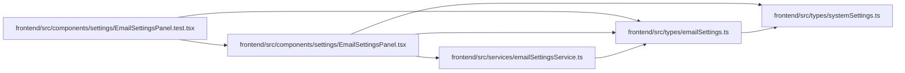

# emailSettings Module

**Path:** `frontend/src/types/emailSettings.ts`

## Description

_Auto-generated from `frontend/src/types/emailSettings.ts`._

## Imports

| Source | Symbols |
|--------|---------|
| `./systemSettings` | `RuntimeSettingSource` |

## Module Signals

| Signal | Values |
|--------|--------|
| Exports | `EmailSettings`, `EmailSettingsUpdate`, `TestEmailRequest`, `TestEmailResponse` |

## Local dependency map

<!-- Auto-generated local dependency summary. Do not edit by hand. -->

### Internal neighbors

| Direction | Module |
|---|---|
| Inbound | [EmailSettingsPanel.test](../modules/EmailSettingsPanel.test.md) |
| Inbound | [EmailSettingsPanel](../modules/EmailSettingsPanel.md) |
| Inbound | [emailSettingsService](../modules/emailSettingsService.md) |
| Outbound | [systemSettings](../modules/systemSettings.md) |

## Classes

| Class | Kind | Line | Bases / Target | Description |
|-------|------|------|----------------|-------------|
| [EmailSettings](../entities/emailSettings_EmailSettings.md) | Class | 3 | — | — |
| [EmailSettingsUpdate](../entities/emailSettings_EmailSettingsUpdate.md) | Class | 16 | — | — |
| [TestEmailRequest](../entities/emailSettings_TestEmailRequest.md) | Class | 28 | — | — |
| [TestEmailResponse](../entities/emailSettings_TestEmailResponse.md) | Class | 32 | — | — |
