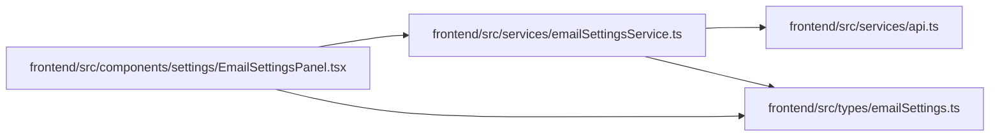

# emailSettingsService Module

**Path:** `frontend/src/services/emailSettingsService.ts`

## Description

_Auto-generated from `frontend/src/services/emailSettingsService.ts`._

## Imports

| Source | Symbols |
|--------|---------|
| `../types/emailSettings` | `EmailSettings`, `EmailSettingsUpdate`, `TestEmailResponse` |
| `./api` | `api` |

## Module Signals

| Signal | Values |
|--------|--------|
| Exports | `emailSettingsService` |
| Constants | `emailSettingsService` |

## Local dependency map

<!-- Auto-generated local dependency summary. Do not edit by hand. -->

### Internal neighbors

| Direction | Module |
|---|---|
| Inbound | [EmailSettingsPanel](../modules/EmailSettingsPanel.md) |
| Outbound | [api](../modules/api.md) |
| Outbound | [emailSettings](../modules/emailSettings.md) |
