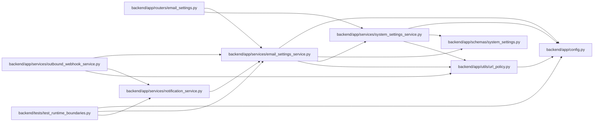

# email_settings_service Module

**Path:** `backend/app/services/email_settings_service.py`

## Description

Email settings service backed by runtime system settings.

## Imports

| Source | Symbols |
|--------|---------|
| `aiosmtplib` | `aiosmtplib` |
| `app.config` | `get_settings` |
| `app.schemas.system_settings` | `RuntimeSettingSource` |
| `app.services.system_settings_service` | `RuntimeSettingsEncryptionError`, `RuntimeSettingsError`, `RuntimeSettingsService` |
| `app.utils.url_policy` | `URLPolicyError`, `validate_public_host` |
| `asyncio` | `asyncio` |
| `dataclasses` | `dataclass`, `field` |
| `email.mime.multipart` | `MIMEMultipart` |
| `email.mime.text` | `MIMEText` |
| `logging` | `logging` |
| `sqlalchemy.ext.asyncio` | `AsyncSession` |
| `typing` | `Optional` |

## Local dependency map

<!-- Auto-generated local dependency summary. Do not edit by hand. -->

### Internal neighbors

| Direction | Module |
|---|---|
| Inbound | [routers_email_settings](../modules/routers_email_settings.md) |
| Inbound | [notification_service](../modules/notification_service.md) |
| Inbound | [outbound_webhook_service](../modules/outbound_webhook_service.md) |
| Inbound | [test_runtime_boundaries](../modules/test_runtime_boundaries.md) |
| Outbound | [config](../modules/config.md) |
| Outbound | [schemas_system_settings](../modules/schemas_system_settings.md) |
| Outbound | [system_settings_service](../modules/system_settings_service.md) |
| Outbound | [url_policy](../modules/url_policy.md) |

### External packages

| Language | Used packages | Undeclared packages |
|---|---:|---:|
| python | 2 | 0 |

## Classes

| Class | Line | Bases | Description |
|-------|------|-------|-------------|
| [EmailSettings](../entities/email_settings_service_EmailSettings.md) | 26 | — | Resolved email settings. |
| [EmailSettingsService](../entities/EmailSettingsService.md) | 52 | — | Manage email settings through ``system_settings``. |
