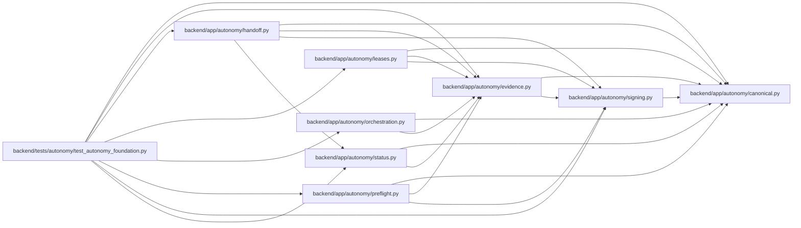

# evidence Module

**Path:** `backend/app/autonomy/evidence.py`

## Description

Source-attested evidence envelopes and append-only attempt coordination.

## Imports

| Source | Symbols |
|--------|---------|
| `__future__` | `annotations` |
| `app.autonomy.canonical` | `StrictContractModel`, `canonical_json_bytes`, `ensure_secret_free`, `sha256_hex` |
| `app.autonomy.signing` | `DetachedSignatureEnvelope`, `PublicTrustResolver`, `verify_detached_signature` |
| `collections.abc` | `Callable` |
| `datetime` | `UTC`, `datetime`, `timedelta` |
| `enum` | `StrEnum` |
| `pydantic` | `Field`, `field_validator`, `model_validator` |
| `typing` | `Any`, `Literal`, `Protocol`, `runtime_checkable` |

## Local dependency map

<!-- Auto-generated local dependency summary. Do not edit by hand. -->

### Internal neighbors

| Direction | Module |
|---|---|
| Inbound | [handoff](../modules/handoff.md) |
| Inbound | [leases](../modules/leases.md) |
| Inbound | [orchestration](../modules/orchestration.md) |
| Inbound | [preflight](../modules/preflight.md) |
| Inbound | [status](../modules/status.md) |
| Inbound | [test_autonomy_foundation](../modules/test_autonomy_foundation.md) |
| Outbound | [autonomy_canonical](../modules/autonomy_canonical.md) |
| Outbound | [signing](../modules/signing.md) |

### External packages

| Language | Used packages | Undeclared packages |
|---|---:|---:|
| python | 1 | 0 |

## Classes

| Class | Kind | Line | Bases / Target | Description |
|-------|------|------|----------------|-------------|
| [RedactionClass](../entities/RedactionClass.md) | Enum | 31 | `StrEnum` | — |
| [AutonomousEvidence](../entities/AutonomousEvidence.md) | Pydantic model | 37 | `StrictContractModel` | Unsigned canonical source observation submitted to a remote signer. |
| [SignedAutonomousEvidence](../entities/SignedAutonomousEvidence.md) | Pydantic model | 102 | `StrictContractModel` | — |
| [WormObjectStore](../entities/WormObjectStore.md) | Class | 111 | `Protocol` | Charter-selected immutable store; implementations must enforce WORM. |
| [EvidenceResolutionError](../entities/EvidenceResolutionError.md) | Class | 123 | `ValueError` | — |
| [EvidenceResolver](../entities/EvidenceResolver.md) | Class | 127 | — | Resolve immutable evidence and verify trust/provenance bindings. |
| [AttemptEventType](../entities/AttemptEventType.md) | Enum | 236 | `StrEnum` | — |
| [AttemptLedgerRecord](../entities/AttemptLedgerRecord.md) | Pydantic model | 247 | `StrictContractModel` | — |
| [AttemptLedgerSnapshot](../entities/AttemptLedgerSnapshot.md) | Pydantic model | 300 | `StrictContractModel` | — |
| [AttemptLedgerBackend](../entities/AttemptLedgerBackend.md) | Class | 307 | `Protocol` | External CAS ledger physically independent of WorkChord PostgreSQL. |
| [AttemptLedgerConflict](../entities/AttemptLedgerConflict.md) | Class | 321 | `RuntimeError` | — |
| [AttemptLedger](../entities/AttemptLedger.md) | Class | 325 | — | Allocate attempt numbers and append every lifecycle fact before action. |

## Functions

| Function | Signature | Decorators | Description |
|----------|-----------|------------|-------------|
| `validate_attempt_ledger_snapshot` | `(snapshot: AttemptLedgerSnapshot) -> AttemptLedgerSnapshot` | — | Replay and validate a complete externally supplied attempt-ledger snapshot. |
| `store_signed_evidence` | `(store: WormObjectStore, signed: SignedAutonomousEvidence) -> str` | — | Put one exact signed envelope under its content digest. |
| `_validate_digest` | `(value: str, field_name: str) -> None` | — | — |
