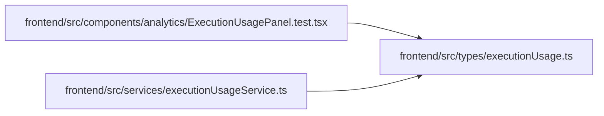

# executionUsage Module

**Path:** `frontend/src/types/executionUsage.ts`

## Description

_Auto-generated from `frontend/src/types/executionUsage.ts`._

## Module Signals

| Signal | Values |
|--------|--------|
| Exports | `ExecutionUsageSummary` |

## Local dependency map

<!-- Auto-generated local dependency summary. Do not edit by hand. -->

### Internal neighbors

| Direction | Module |
|---|---|
| Inbound | [ExecutionUsagePanel.test](../modules/ExecutionUsagePanel.test.md) |
| Inbound | [executionUsageService](../modules/executionUsageService.md) |

## Classes

| Class | Kind | Line | Bases / Target | Description |
|-------|------|------|----------------|-------------|
| [ExecutionUsageSummary](../entities/executionUsage_ExecutionUsageSummary.md) | Class | 1 | — | — |
