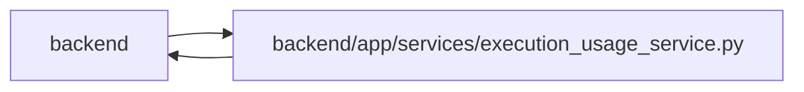

# execution_usage_service Module

**Path:** `backend/app/services/execution_usage_service.py`

## Description

Writers reserve Task, Actor and Run in execution-compatible order, recheck reporter ownership and scope, and append bounded revisions under an exact previous-digest condition. Exact logical replay returns its receipt. Corrections keep the first report scope and prior pricing. Scoped summaries separate currencies, unknown costs, simulations, missing reports and accepted-outcome linkage; advisory budgets do not change execution policy.

Bounded usage corrections, immutable pricing and scoped advisory totals.

## Imports

| Source | Symbols |
|--------|---------|
| `app.authority` | `AuthorityError`, `internal_authority`, `require_project` |
| `app.commands` | `atomic_command` |
| `app.models.agent` | `AgentActor`, `AgentRun` |
| `app.models.delivery_observation` | `DeliveryObservation` |
| `app.models.execution_usage` | `ExecutionUsageRecord` |
| `app.models.iteration` | `Iteration` |
| `app.models.project` | `Project` |
| `app.models.task` | `Task` |
| `app.query_limits` | `CollectionLimitExceededError` |
| `app.schemas.execution_usage` | `ExecutionUsageResponse`, `ExecutionUsageSummary`, `ExecutionUsageWrite` |
| `app.services.agent_service` | `AgentConflictError`, `AgentPermissionError`, `actor_has_scope` |
| `app.services.delivery_metrics_service` | `DeliveryMetricsService` |
| `app.utils.time` | `as_utc`, `utc_now` |
| `collections` | `defaultdict` |
| `datetime` | `timedelta` |
| `decimal` | `Decimal`, `localcontext` |
| `hashlib` | `hashlib` |
| `json` | `json` |
| `sqlalchemy` | `select`, `update` |

## Local dependency map

<!-- Auto-generated local dependency summary. Do not edit by hand. -->

> Module-level dependencies exceed the generated-diagram limits, so the diagram and table below group them by top-level package. Counts report the number of module neighbors in each package.

### Internal neighbors

| Direction | Module |
|---|---|
| Inbound | `backend` (4) |
| Outbound | `backend` (13) |

### External packages

| Language | Used packages | Undeclared packages |
|---|---:|---:|
| python | 1 | 0 |

> All 17 module neighbor(s) are summarized by package because the module-level view exceeds the 12-node limit.

## Classes

| Class | Line | Bases | Description |
|-------|------|-------|-------------|
| [ExecutionUsageService](../entities/ExecutionUsageService.md) | 50 | — | — |

## Functions

| Function | Signature | Decorators | Description |
|----------|-----------|------------|-------------|
| `run_identity` | `(run)` | — | Distinguish attempts even if a legacy numeric run ID is reused. |
| `estimate_cost` | `(report)` | — | — |
| `add_exact` | `(bucket, key, amount)` | — | — |
