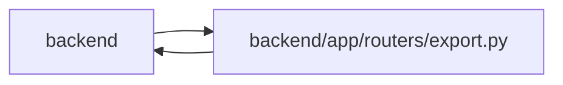

# export Module

**Path:** `backend/app/routers/export.py`

## Description

Export/Import API router.

## Imports

| Source | Symbols |
|--------|---------|
| `app.commands` | `commit_or_flush`, `command_transaction`, `planning_input_reservation`, `lock_iterations` |
| `app.database` | `get_db` |
| `app.models.task` | `TaskDependency` |
| `app.query_limits` | `MAX_SYNC_EXPORT_TASKS` |
| `app.schemas.common` | `MessageResponse` |
| `app.schemas.iteration` | `IterationCreate` |
| `app.schemas.task` | `TaskCreate` |
| `app.schemas.team` | `TeamMemberCreate`, `VacationCreate` |
| `app.security` | `require_admin_api_key` |
| `app.services.import_planning_service` | `observe_import_planning` |
| `app.services.iteration_service` | `IterationService` |
| `app.services.task_service` | `TaskService` |
| `app.services.team_service` | `TeamService` |
| `app.services.work_metrics` | `aggregate_metrics` |
| `datetime` | `timedelta`, `date`, `date`, `date` |
| `fastapi` | `APIRouter`, `Depends`, `File`, `HTTPException`, `UploadFile`, `status` |
| `fastapi.encoders` | `jsonable_encoder` |
| `fastapi.responses` | `JSONResponse` |
| `json` | `json` |
| `sqlalchemy.ext.asyncio` | `AsyncSession` |
| `typing` | `Annotated`, `Any`, `Optional` |

## Local dependency map

<!-- Auto-generated local dependency summary. Do not edit by hand. -->

> Module-level dependencies exceed the generated-diagram limits, so the diagram and table below group them by top-level package. Counts report the number of module neighbors in each package.

### Internal neighbors

| Direction | Module |
|---|---|
| Inbound | `backend` (3) |
| Outbound | `backend` (14) |

### External packages

| Language | Used packages | Undeclared packages |
|---|---:|---:|
| python | 2 | 0 |

> All 17 module neighbor(s) are summarized by package because the module-level view exceeds the 12-node limit.

## Functions

| Function | Signature | Decorators | Description |
|----------|-----------|------------|-------------|
| `_optional_int` | `(value, field_name: str) -> int \| None` | — | Parse optional integer values from backward-compatible JSON imports. |
| `_read_json_upload` | *(async)* `(file: UploadFile) -> dict[str, Any]` | — | Read a bounded JSON upload into an object. |
| `_validate_import_task_tree` | `(task_data: Any, *, depth: int, counter: list[int]) -> None` | — | Validate an arbitrarily deep task tree with bounded total cardinality. |
| `export_iteration` | *(async)* `(iteration_id: int, db: Annotated[AsyncSession, Depends(get_db, scope='function')])` | `@router.get('/iterations/{iteration_id}/export')` | Export iteration data as JSON. |
| `_task_to_export` | `(task) -> dict` | — | Convert task to export format recursively with full Gantt data. |
| `_validate_import_data` | `(data)` | — | Validate the complete bounded tree before any imported row can persist. |
| `preview_iteration_import` | *(async)* `(file: Annotated[UploadFile, File(...)], db: Annotated[AsyncSession, Depends(get_db, scope='function')], iteration_id: int \| None = None)` | `@router.post('/iterations/import-context')`, `@router.post('/iterations/{iteration_id}/import-context')` | Observe all existing scopes before opening a JSON import confirmation. |
| `import_new_iteration` | *(async)* `(file: Annotated[UploadFile, File(...)], db: Annotated[AsyncSession, Depends(get_db, scope='function')])` | `@router.post('/iterations/import')` | Import a new iteration from JSON export file. |
| `_process_import` | *(async)* `(iteration_id: int, data: dict, db: AsyncSession, *, create_snapshots: bool = True)` | — | Import team members and tasks while preserving task metadata and dependencies. |
| `import_iteration` | *(async)* `(iteration_id: int, file: Annotated[UploadFile, File(...)], db: Annotated[AsyncSession, Depends(get_db, scope='function')])` | `@router.post('/iterations/{iteration_id}/import')` | Import tasks and team members into an iteration from JSON file. |
| `_import_task_record` | *(async)* `(task_service: TaskService, iteration_id: int, task_data: dict, parent_id: Optional[int], name_to_member_id: dict[str, int], id_to_new_id: dict[int, int], external_key_to_new_id: dict[str, int], pending_dependencies: list[tuple[int, list[int], list[str]]], *, create_snapshots: bool = True)` | — | Import one task record after its parent has been persisted. |
| `_import_task` | *(async)* `(task_service: TaskService, iteration_id: int, task_data: dict, parent_id: Optional[int], name_to_member_id: dict[str, int], id_to_new_id: dict[int, int], external_key_to_new_id: dict[str, int], pending_dependencies: list[tuple[int, list[int], list[str]]], *, create_snapshots: bool = True) -> None` | — | Import a complete task tree iteratively so product depth stays unbounded. |
