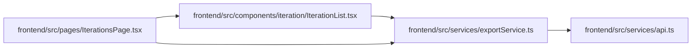

# exportService Module

**Path:** `frontend/src/services/exportService.ts`

## Description

_Auto-generated from `frontend/src/services/exportService.ts`._

## Imports

| Source | Symbols |
|--------|---------|
| `./api` | `api` |

## Module Signals

| Signal | Values |
|--------|--------|
| Exports | `exportService` |
| Constants | `exportService` |

## Local dependency map

<!-- Auto-generated local dependency summary. Do not edit by hand. -->

### Internal neighbors

| Direction | Module |
|---|---|
| Inbound | [IterationList](../modules/IterationList.md) |
| Inbound | [IterationsPage](../modules/IterationsPage.md) |
| Outbound | [api](../modules/api.md) |
