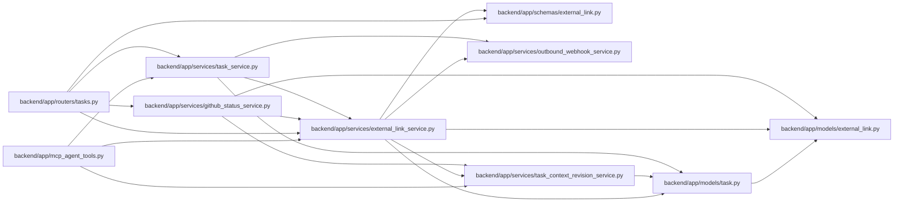

# external_link_service Module

**Path:** `backend/app/services/external_link_service.py`

## Description

External link service.

## Imports

| Source | Symbols |
|--------|---------|
| `app.models.external_link` | `ExternalLink`, `ExternalLinkEntityType` |
| `app.models.task` | `Task` |
| `app.schemas.external_link` | `ExternalLinkCreate`, `ExternalLinkEntityType`, `ExternalLinkProvider`, `ExternalLinkResponse`, `ExternalLinkUpdate`, `TaskExternalLinkCreate` |
| `app.services.outbound_webhook_service` | `emit_outbound_webhook_event` |
| `app.services.task_context_revision_service` | `reserve_task_context_revision` |
| `dataclasses` | `dataclass` |
| `sqlalchemy` | `delete`, `select` |
| `sqlalchemy.ext.asyncio` | `AsyncSession` |
| `typing` | `Any`, `Optional`, `Sequence` |
| `urllib.parse` | `urlparse` |

## Local dependency map

<!-- Auto-generated local dependency summary. Do not edit by hand. -->

### Internal neighbors

| Direction | Module |
|---|---|
| Inbound | [mcp_agent_tools](../modules/mcp_agent_tools.md) |
| Inbound | [tasks](../modules/tasks.md) |
| Inbound | [github_status_service](../modules/github_status_service.md) |
| Inbound | [task_service](../modules/task_service.md) |
| Outbound | [models_external_link](../modules/models_external_link.md) |
| Outbound | [models_task](../modules/models_task.md) |
| Outbound | [schemas_external_link](../modules/schemas_external_link.md) |
| Outbound | [outbound_webhook_service](../modules/outbound_webhook_service.md) |
| Outbound | [task_context_revision_service](../modules/task_context_revision_service.md) |

### External packages

| Language | Used packages | Undeclared packages |
|---|---:|---:|
| python | 1 | 0 |

## Classes

| Class | Line | Bases | Description |
|-------|------|-------|-------------|
| [ExternalLinkValidationError](../entities/ExternalLinkValidationError.md) | 23 | `ValueError` | Raised when a provider-specific link cannot be parsed. |
| [ExternalLinkConflictError](../entities/ExternalLinkConflictError.md) | 27 | `Exception` | Raised when a provider-specific link already exists for an entity. |
| [ParsedGitHubLink](../entities/ParsedGitHubLink.md) | 32 | — | Normalized GitHub link details ready for persistence. |
| [ExternalLinkService](../entities/ExternalLinkService.md) | 61 | — | Service for generic external links and task-scoped link operations. |
