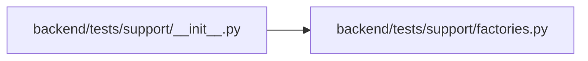

# factories Module

**Path:** `backend/tests/support/factories.py`

## Description

Deterministic mapped-model and representative legacy-database factories.

## Imports

| Source | Symbols |
|--------|---------|
| `__future__` | `annotations` |
| `datetime` | `UTC`, `date`, `datetime` |
| `pathlib` | `Path` |
| `sqlalchemy` | `Boolean`, `Date`, `DateTime`, `Float`, `Integer`, `JSON`, `LargeBinary`, `Numeric`, `inspect` |
| `sqlalchemy.sql.sqltypes` | `String` |
| `sqlalchemy.types` | `TypeDecorator` |
| `sqlite3` | `sqlite3` |
| `typing` | `Any` |

## Local dependency map

<!-- Auto-generated local dependency summary. Do not edit by hand. -->

### Internal neighbors

| Direction | Module |
|---|---|
| Inbound | [support___init__](../modules/support___init__.md) |

### External packages

| Language | Used packages | Undeclared packages |
|---|---:|---:|
| python | 1 | 0 |

## Classes

| Class | Line | Bases | Description |
|-------|------|-------|-------------|
| [MappedModelFactory](../entities/MappedModelFactory.md) | 16 | — | Build any registered SQLAlchemy model with deterministic safe values. |
| [LegacySQLiteFactory](../entities/LegacySQLiteFactory.md) | 80 | — | Create representative pre-Alembic SQLite sources for migration tests. |
