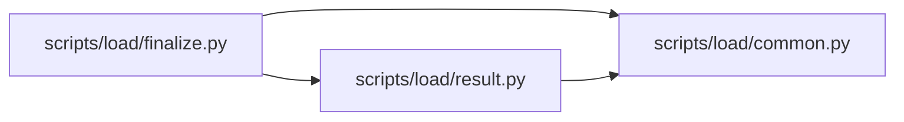

# finalize Module

**Path:** `scripts/load/finalize.py`

## Description

Bind post-run external evidence to one sealed client load result.

## Imports

| Source | Symbols |
|--------|---------|
| `__future__` | `annotations` |
| `argparse` | `argparse` |
| `pathlib` | `Path` |
| `scripts.load.common` | `QualificationInputError`, `atomic_write_json`, `read_json_object` |
| `scripts.load.result` | `evaluate_client_gates`, `evaluate_external_gates`, `evaluate_workload_gates`, `result_status`, `validate_result` |
| `sys` | `sys` |
| `typing` | `Any`, `Mapping` |

## Local dependency map

<!-- Auto-generated local dependency summary. Do not edit by hand. -->

### Internal neighbors

| Direction | Module |
|---|---|
| Outbound | [load_common](../modules/load_common.md) |
| Outbound | [result](../modules/result.md) |

## Functions

| Function | Signature | Decorators | Description |
|----------|-----------|------------|-------------|
| `_load_reference` | `(document: Mapping[str, Any]) -> Mapping[str, Any]` | — | — |
| `finalize_result` | `(client_result_path: Path, external_metrics_path: Path, integrity_path: Path, output_path: Path) -> dict[str, Any]` | — | Re-evaluate every gate with evidence captured after the client run. |
| `_parser` | `() -> argparse.ArgumentParser` | — | — |
| `main` | `() -> int` | — | — |
