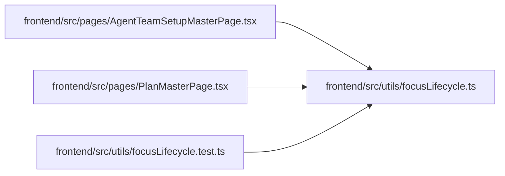

# focusLifecycle Module

**Path:** `frontend/src/utils/focusLifecycle.ts`

## Description

_Auto-generated from `frontend/src/utils/focusLifecycle.ts`._

## Module Signals

| Signal | Values |
|--------|--------|
| Exports | `captureFocusOrigin`, `focusOwnedTarget` |

## Local dependency map

<!-- Auto-generated local dependency summary. Do not edit by hand. -->

### Internal neighbors

| Direction | Module |
|---|---|
| Inbound | [AgentTeamSetupMasterPage](../modules/AgentTeamSetupMasterPage.md) |
| Inbound | [PlanMasterPage](../modules/PlanMasterPage.md) |
| Inbound | [focusLifecycle.test](../modules/focusLifecycle.test.md) |

## Functions

| Function | Signature | Decorators | Description |
|----------|-----------|------------|-------------|
| `captureFocusOrigin` | `() -> HTMLElement \| null` | — | — |
| `focusOwnedTarget` | `(origin: HTMLElement \| null, target: HTMLElement \| null) -> boolean` | — | — |
