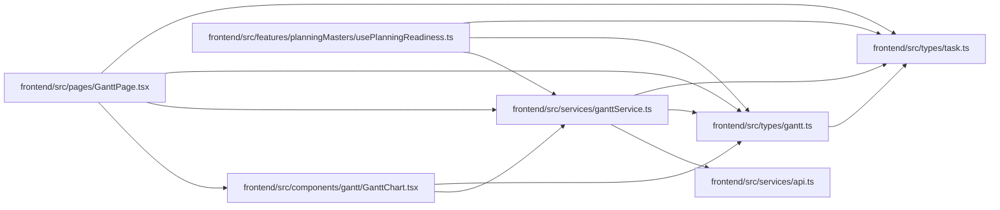

# ganttService Module

**Path:** `frontend/src/services/ganttService.ts`

## Description

_Auto-generated from `frontend/src/services/ganttService.ts`._

## Imports

| Source | Symbols |
|--------|---------|
| `../types/gantt` | `ExplainScheduleDetailLevel`, `ExplainScheduleRequest`, `ExplainScheduleResponse`, `GanttResponse`, `SchedulePreviewResponse`, `ScheduleResult` |
| `../types/task` | `TaskBatchUpdateItem` |
| `./api` | `api` |

## Module Signals

| Signal | Values |
|--------|--------|
| Exports | `ganttService` |
| Constants | `ganttService` |

## Local dependency map

<!-- Auto-generated local dependency summary. Do not edit by hand. -->

### Internal neighbors

| Direction | Module |
|---|---|
| Inbound | [GanttChart](../modules/GanttChart.md) |
| Inbound | [usePlanningReadiness](../modules/usePlanningReadiness.md) |
| Inbound | [GanttPage](../modules/GanttPage.md) |
| Outbound | [api](../modules/api.md) |
| Outbound | [types_gantt](../modules/types_gantt.md) |
| Outbound | [types_task](../modules/types_task.md) |
