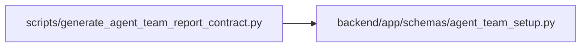

# generate_agent_team_report_contract Module

**Path:** `scripts/generate_agent_team_report_contract.py`

## Description

Generate the JSON Schema for the bounded agent-team setup report.

## Imports

| Source | Symbols |
|--------|---------|
| `__future__` | `annotations` |
| `app.schemas.agent_team_setup` | `AgentTeamSetupReport` |
| `argparse` | `argparse` |
| `json` | `json` |
| `pathlib` | `Path` |
| `sys` | `sys` |

## Local dependency map

<!-- Auto-generated local dependency summary. Do not edit by hand. -->

### Internal neighbors

| Direction | Module |
|---|---|
| Outbound | [agent_team_setup](../modules/agent_team_setup.md) |

### External packages

| Language | Used packages | Undeclared packages |
|---|---:|---:|
| python | 1 | 1 |

## Functions

| Function | Signature | Decorators | Description |
|----------|-----------|------------|-------------|
| `parse_args` | `() -> argparse.Namespace` | — | — |
| `rendered_schema` | `() -> bytes` | — | — |
| `main` | `() -> int` | — | — |
