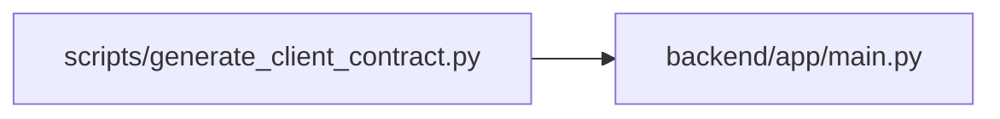

# generate_client_contract Module

**Path:** `scripts/generate_client_contract.py`

## Description

Derives the shared task, session and triage wire contract from registered FastAPI operations and their transitive Pydantic schema references. Sorted serialization makes drift review deterministic. Schema capabilities describe present fields only; they do not enable runtime features or prove client adoption.

The exported readers include project, iteration, portfolio-summary and task-timeline pages, with cursor parameters and their response schemas. Removing any listed route prevents export. The mobile snapshot embeds this same contract instead of maintaining a separate paging definition.

## Imports

| Source | Symbols |
|--------|---------|
| `app.main` | `app` |
| `argparse` | `argparse` |
| `json` | `json` |
| `pathlib` | `Path` |

## Local dependency map

<!-- Auto-generated local dependency summary. Do not edit by hand. -->

### Internal neighbors

| Direction | Module |
|---|---|
| Outbound | [app_main](../modules/app_main.md) |

### External packages

| Language | Used packages | Undeclared packages |
|---|---:|---:|
| python | 1 | 1 |

## Functions

| Function | Signature | Decorators | Description |
|----------|-----------|------------|-------------|
| `build_contract` | `()` | — | — |
| `serialized_contract` | `()` | — | — |
| `main` | `()` | — | — |
