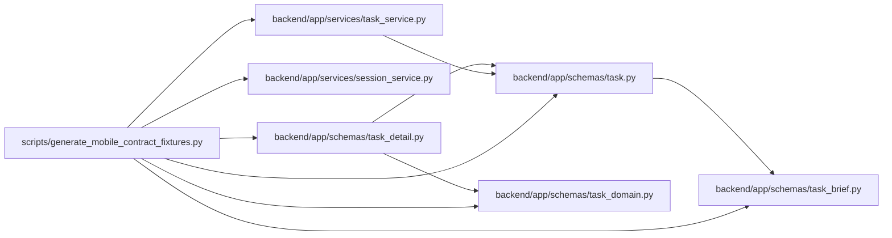

# generate_mobile_contract_fixtures Module

**Path:** `scripts/generate_mobile_contract_fixtures.py`

## Description

Exports deterministic Android examples through canonical backend schemas, the backend conflict envelope and cookie helper, together with the selected OpenAPI contract. Current nested/backlog, bounded-detail, action, review and cascade examples share source truth; legacy additive-field omissions stay readable without inventing criterion evidence. These examples establish contract shape rather than real-device delivery.

## Imports

| Source | Symbols |
|--------|---------|
| `app.schemas.task` | `TaskResponse`, `TaskStatusChangeResponse`, `CascadeUpdateInfo` |
| `app.schemas.task_brief` | `TaskBrief`, `BriefCriterion`, `TaskReviewResponse` |
| `app.schemas.task_detail` | `TaskDetailResponse`, `TaskReference`, `TaskReferencePage` |
| `app.schemas.task_domain` | `TaskActionsResponse`, `TaskActionAvailability` |
| `app.services.session_service` | `_cookie_options` |
| `app.services.task_service` | `TaskVersionConflictError` |
| `argparse` | `argparse` |
| `datetime` | `UTC`, `datetime` |
| `generate_client_contract` | `build_contract` |
| `json` | `json` |
| `pathlib` | `Path` |
| `starlette.responses` | `Response` |

## Local dependency map

<!-- Auto-generated local dependency summary. Do not edit by hand. -->

### Internal neighbors

| Direction | Module |
|---|---|
| Outbound | [schemas_task](../modules/schemas_task.md) |
| Outbound | [schemas_task_brief](../modules/schemas_task_brief.md) |
| Outbound | [task_detail](../modules/task_detail.md) |
| Outbound | [schemas_task_domain](../modules/schemas_task_domain.md) |
| Outbound | [session_service](../modules/session_service.md) |
| Outbound | [task_service](../modules/task_service.md) |

### External packages

| Language | Used packages | Undeclared packages |
|---|---:|---:|
| python | 3 | 3 |

## Functions

| Function | Signature | Decorators | Description |
|----------|-----------|------------|-------------|
| `build_examples` | `()` | — | — |
| `serialized_examples` | `()` | — | — |
| `main` | `()` | — | — |
