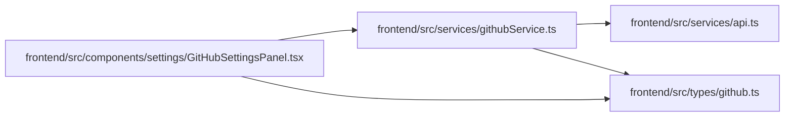

# githubService Module

**Path:** `frontend/src/services/githubService.ts`

## Description

_Auto-generated from `frontend/src/services/githubService.ts`._

## Imports

| Source | Symbols |
|--------|---------|
| `../types/github` | `GitHubStatusAutomationRule`, `GitHubStatusAutomationRuleCreate`, `GitHubStatusAutomationRuleUpdate` |
| `./api` | `api` |

## Module Signals

| Signal | Values |
|--------|--------|
| Exports | `githubService` |
| Constants | `githubService` |

## Local dependency map

<!-- Auto-generated local dependency summary. Do not edit by hand. -->

### Internal neighbors

| Direction | Module |
|---|---|
| Inbound | [GitHubSettingsPanel](../modules/GitHubSettingsPanel.md) |
| Outbound | [api](../modules/api.md) |
| Outbound | [types_github](../modules/types_github.md) |
