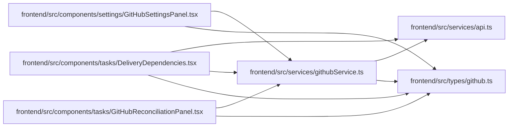

# githubService Module

**Path:** `frontend/src/services/githubService.ts`

## Description

_Auto-generated from `frontend/src/services/githubService.ts`._

## Imports

| Source | Symbols | Type-only | Runtime emission |
|--------|---------|-----------|------------------|
| `../types/github` | `DeliveryPrerequisite`, `GitHubReconciliation`, `GitHubStatusAutomationRule`, `GitHubStatusAutomationRuleCreate`, `GitHubStatusAutomationRuleUpdate` | Declaration | erased |
| `./api` | `api` | — | compiler-dependent |

## Module Signals

| Signal | Values |
|--------|--------|
| Exports | `githubService` |
| Constants | `githubService` |

## Local dependency map

<!-- Auto-generated local dependency summary. Do not edit by hand. -->
This graph shows full source coupling. Type dependencies can be erased; compiler-dependent cycle groups are runtime candidates, not confirmed initialization cycles.

```mermaid
flowchart LR
    n0["frontend/src/components/settings/GitHubSettingsPanel.tsx"]
    n1["frontend/src/components/tasks/DeliveryDependencies.tsx"]
    n2["frontend/src/components/tasks/GitHubReconciliationPanel.tsx"]
    n3["frontend/src/services/api.ts"]
    n4["frontend/src/services/githubService.ts"]
    n5["frontend/src/types/github.ts"]
    n0 --> n4
    n0 --> n5
    n1 --> n3
    n1 --> n4
    n1 --> n5
    n2 --> n4
    n2 --> n5
    n4 --> n3
    n4 --> n5
    click n0 "../modules/GitHubSettingsPanel.md"
    click n1 "../modules/DeliveryDependencies.md"
    click n2 "../modules/GitHubReconciliationPanel.md"
    click n3 "../modules/api.md"
    click n4 "../modules/githubService.md"
    click n5 "../modules/types_github.md"
```

### Internal neighbors

| Direction | Module |
|---|---|
| Inbound | [GitHubSettingsPanel](../modules/GitHubSettingsPanel.md) |
| Inbound | [DeliveryDependencies](../modules/DeliveryDependencies.md) |
| Inbound | [GitHubReconciliationPanel](../modules/GitHubReconciliationPanel.md) |
| Outbound | [api](../modules/api.md) |
| Outbound | [types_github](../modules/types_github.md) |
