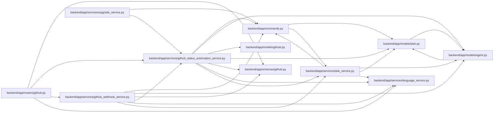

# github_status_automation_service Module

**Path:** `backend/app/services/github_status_automation_service.py`

## Description

GitHub status automation rule service.

## Imports

| Source | Symbols |
|--------|---------|
| `app.commands` | `commit_or_flush` |
| `app.models.agent` | `TaskEvent` |
| `app.models.github` | `GitHubStatusAutomationRule` |
| `app.models.task` | `TaskStatus` |
| `app.schemas.github` | `GitHubStatusAutomationResult`, `GitHubStatusAutomationRuleCreate`, `GitHubStatusAutomationRuleUpdate` |
| `app.services.language_service` | `LanguageCode`, `backend_error_message`, `entity_not_found_message`, `invalid_status_transition_message`, `localized`, `resolve_runtime_ui_language` |
| `app.services.task_service` | `TaskService` |
| `collections` | `defaultdict` |
| `sqlalchemy` | `select` |
| `sqlalchemy.ext.asyncio` | `AsyncSession` |
| `typing` | `Any`, `Optional` |

## Local dependency map

<!-- Auto-generated local dependency summary. Do not edit by hand. -->

### Internal neighbors

| Direction | Module |
|---|---|
| Inbound | [routers_github](../modules/routers_github.md) |
| Inbound | [github_webhook_service](../modules/github_webhook_service.md) |
| Inbound | [upgrade_service](../modules/upgrade_service.md) |
| Outbound | [commands](../modules/commands.md) |
| Outbound | [models_agent](../modules/models_agent.md) |
| Outbound | [models_github](../modules/models_github.md) |
| Outbound | [models_task](../modules/models_task.md) |
| Outbound | [schemas_github](../modules/schemas_github.md) |
| Outbound | [language_service](../modules/language_service.md) |
| Outbound | [task_service](../modules/task_service.md) |

### External packages

| Language | Used packages | Undeclared packages |
|---|---:|---:|
| python | 1 | 0 |

## Classes

| Class | Line | Bases | Description |
|-------|------|-------|-------------|
| [_SafeFormatDict](../entities/SafeFormatDict.md) | 70 | `defaultdict` | Leave unknown reason-template placeholders readable. |
| [GitHubStatusAutomationService](../entities/GitHubStatusAutomationService.md) | 77 | — | Manage and apply GitHub status automation rules. |
