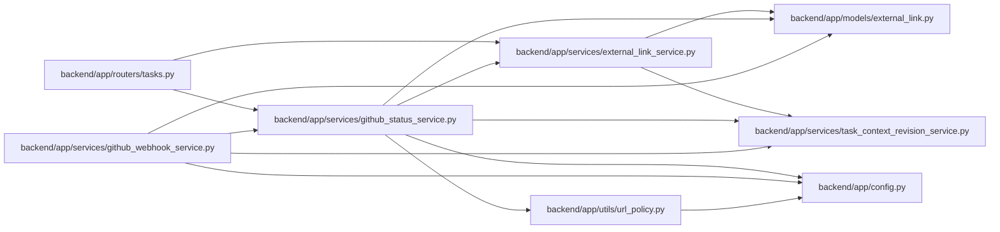

# github_status_service Module

**Path:** `backend/app/services/github_status_service.py`

## Description

GitHub pull request status refresh service.

## Imports

| Source | Symbols |
|--------|---------|
| `app.config` | `get_settings` |
| `app.models.external_link` | `ExternalLink`, `ExternalLinkEntityType` |
| `app.services.external_link_service` | `ExternalLinkService`, `ExternalLinkValidationError` |
| `app.services.task_context_revision_service` | `reserve_task_context_revision` |
| `app.utils.url_policy` | `normalize_provider_api_url` |
| `datetime` | `datetime`, `timezone` |
| `httpx` | `httpx` |
| `logging` | `logging` |
| `sqlalchemy.ext.asyncio` | `AsyncSession` |
| `typing` | `Any`, `Optional` |

## Local dependency map

<!-- Auto-generated local dependency summary. Do not edit by hand. -->

### Internal neighbors

| Direction | Module |
|---|---|
| Inbound | [tasks](../modules/tasks.md) |
| Inbound | [github_webhook_service](../modules/github_webhook_service.md) |
| Outbound | [config](../modules/config.md) |
| Outbound | [models_external_link](../modules/models_external_link.md) |
| Outbound | [external_link_service](../modules/external_link_service.md) |
| Outbound | [task_context_revision_service](../modules/task_context_revision_service.md) |
| Outbound | [url_policy](../modules/url_policy.md) |

### External packages

| Language | Used packages | Undeclared packages |
|---|---:|---:|
| python | 2 | 0 |

## Classes

| Class | Line | Bases | Description |
|-------|------|-------|-------------|
| [GitHubStatusService](../entities/GitHubStatusService.md) | 22 | — | Refresh cached GitHub pull request metadata for external links. |
