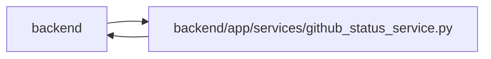

# github_status_service Module

**Path:** `backend/app/services/github_status_service.py`

## Description

GitHub pull request status refresh service.

Candidate verification reads a pull request’s current head or compares an immutable base and head in the submitted repository. Every commit in the bounded range must have attributable evidence. Incomplete pagination, an unexpected head or unattributed contributors prevent a passing candidate observation.

## Imports

| Source | Symbols |
|--------|---------|
| `app.commands` | `commit_or_flush`, `command_transaction` |
| `app.config` | `get_settings` |
| `app.models.agent` | `TaskEvent` |
| `app.models.external_link` | `ExternalLink`, `ExternalLinkEntityType` |
| `app.services.external_link_service` | `ExternalLinkService`, `ExternalLinkValidationError` |
| `app.services.github_reconciliation_service` | `observed_head_keeps_acceptance`, `observed_head_keeps_acceptance` |
| `app.services.system_settings_service` | `RuntimeSettingsService` |
| `app.services.task_context_revision_service` | `reserve_task_context_revision` |
| `app.services.task_service` | `TaskService` |
| `app.utils.url_policy` | `normalize_provider_api_url` |
| `dataclasses` | `dataclass` |
| `datetime` | `datetime`, `timezone` |
| `httpx` | `httpx` |
| `logging` | `logging` |
| `re` | `re` |
| `sqlalchemy` | `select` |
| `sqlalchemy.ext.asyncio` | `AsyncSession` |
| `typing` | `Any`, `Optional` |

## Local dependency map

<!-- Auto-generated local dependency summary. Do not edit by hand. -->

```mermaid
flowchart LR
    n0["backend"]
    n1["backend/app/services/github_status_service.py"]
    n0 --> n1
    n1 --> n0
    click n1 "../modules/github_status_service.md"
```

> Module-level dependencies exceed the generated-diagram limits, so the diagram and table below group them by top-level package. Counts report the number of module neighbors in each package.

### Internal neighbors

| Direction | Module |
|---|---|
| Inbound | `backend` (12) |
| Outbound | `backend` (10) |

### External packages

| Language | Used packages | Undeclared packages |
|---|---:|---:|
| python | 2 | 0 |

> All 21 module neighbor(s) are summarized by package because the module-level view exceeds the 12-node limit.

## Classes

| Class | Line | Bases | Description |
|-------|------|-------|-------------|
| [FetchedPullRequest](../entities/FetchedPullRequest.md) | 29 | — | One pull request link as read from GitHub, before anything is locked or saved. |
| [GitHubStatusService](../entities/GitHubStatusService.md) | 61 | — | Refresh cached GitHub pull request metadata for external links. |

## Functions

| Function | Signature | Decorators | Description |
|----------|-----------|------------|-------------|
| `parse_github_time` | `(value: Any) -> Optional[datetime]` | — | Parse a GitHub ISO timestamp, or None when it is absent or malformed. |
| `payload_merged` | `(payload: dict[str, Any]) -> bool` | — | Whether a pull request payload describes a merged pull request. |
