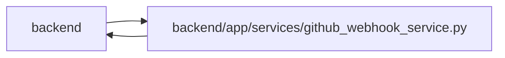

# github_webhook_service Module

**Path:** `backend/app/services/github_webhook_service.py`

## Description

GitHub webhook intake service.

## Imports

| Source | Symbols |
|--------|---------|
| `app.commands` | `commit_or_flush` |
| `app.config` | `get_settings` |
| `app.models.agent` | `TaskEvent` |
| `app.models.external_link` | `ExternalLink`, `ExternalLinkEntityType` |
| `app.models.triage` | `TriageItem` |
| `app.schemas.github` | `GitHubWebhookResponse` |
| `app.schemas.triage` | `TriageItemCreate` |
| `app.services.github_status_automation_service` | `GitHubStatusAutomationService` |
| `app.services.github_status_service` | `GitHubStatusService` |
| `app.services.language_service` | `LanguageCode`, `localized`, `resolve_runtime_ui_language` |
| `app.services.outbound_webhook_service` | `emit_outbound_webhook_event` |
| `app.services.task_context_revision_service` | `reserve_task_context_revision` |
| `app.services.task_service` | `TaskService` |
| `app.services.triage_service` | `TriageService` |
| `datetime` | `datetime`, `timezone` |
| `hashlib` | `hashlib` |
| `hmac` | `hmac` |
| `json` | `json` |
| `sqlalchemy` | `select` |
| `sqlalchemy.ext.asyncio` | `AsyncSession` |
| `typing` | `Any`, `Optional` |

## Local dependency map

<!-- Auto-generated local dependency summary. Do not edit by hand. -->

> Module-level dependencies exceed the generated-diagram limits, so the diagram and table below group them by top-level package. Counts report the number of module neighbors in each package.

### Internal neighbors

| Direction | Module |
|---|---|
| Inbound | `backend` (1) |
| Outbound | `backend` (14) |

### External packages

| Language | Used packages | Undeclared packages |
|---|---:|---:|
| python | 1 | 0 |

> All 15 module neighbor(s) are summarized by package because the module-level view exceeds the 12-node limit.

## Classes

| Class | Line | Bases | Description |
|-------|------|-------|-------------|
| [GitHubWebhookConfigurationError](../entities/GitHubWebhookConfigurationError.md) | 39 | `RuntimeError` | Raised when webhook processing is not configured. |
| [GitHubWebhookSignatureError](../entities/GitHubWebhookSignatureError.md) | 43 | `ValueError` | Raised when a webhook signature is missing or invalid. |
| [GitHubWebhookPayloadError](../entities/GitHubWebhookPayloadError.md) | 47 | `ValueError` | Raised when a webhook payload cannot be processed. |
| [GitHubWebhookService](../entities/GitHubWebhookService.md) | 51 | — | Verify and process GitHub webhook deliveries. |
