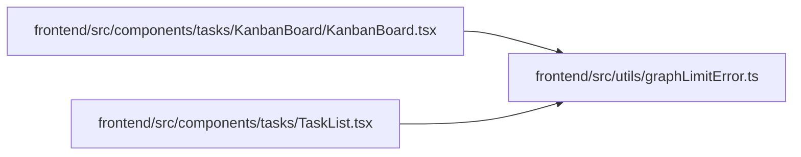

# graphLimitError Module

**Path:** `frontend/src/utils/graphLimitError.ts`

## Description

_Auto-generated from `frontend/src/utils/graphLimitError.ts`._

## Module Signals

| Signal | Values |
|--------|--------|
| Exports | `isGraphLimitError` |

## Local dependency map

<!-- Auto-generated local dependency summary. Do not edit by hand. -->

### Internal neighbors

| Direction | Module |
|---|---|
| Inbound | [KanbanBoard](../modules/KanbanBoard.md) |
| Inbound | [TaskList](../modules/TaskList.md) |

## Functions

| Function | Signature | Decorators | Description |
|----------|-----------|------------|-------------|
| `isGraphLimitError` | `(error: unknown)` | — | — |
