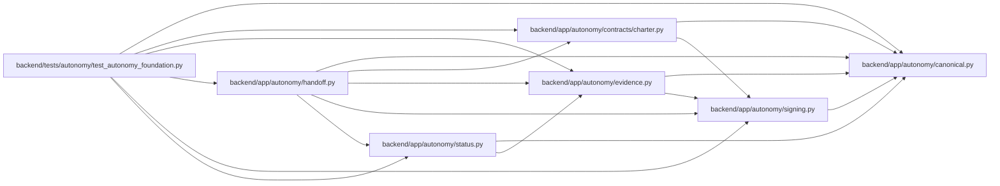

# handoff Module

**Path:** `backend/app/autonomy/handoff.py`

## Description

Deterministic, unpublished manual-handoff and closeout decision tooling.

## Imports

| Source | Symbols |
|--------|---------|
| `__future__` | `annotations` |
| `app.autonomy.canonical` | `StrictContractModel`, `canonical_json_bytes`, `ensure_secret_free`, `sha256_hex` |
| `app.autonomy.contracts.charter` | `ProgramDecision` |
| `app.autonomy.evidence` | `RedactionClass`, `SignedAutonomousEvidence`, `WormObjectStore` |
| `app.autonomy.signing` | `DetachedSignatureEnvelope`, `PublicTrustResolver`, `RemoteSigner`, `verify_detached_signature` |
| `app.autonomy.status` | `StatusAmendmentLedger` |
| `datetime` | `UTC`, `datetime` |
| `enum` | `StrEnum` |
| `pydantic` | `Field`, `field_validator`, `model_validator` |
| `typing` | `Literal` |

## Local dependency map

<!-- Auto-generated local dependency summary. Do not edit by hand. -->

### Internal neighbors

| Direction | Module |
|---|---|
| Inbound | [test_autonomy_foundation](../modules/test_autonomy_foundation.md) |
| Outbound | [autonomy_canonical](../modules/autonomy_canonical.md) |
| Outbound | [charter](../modules/charter.md) |
| Outbound | [evidence](../modules/evidence.md) |
| Outbound | [signing](../modules/signing.md) |
| Outbound | [status](../modules/status.md) |

### External packages

| Language | Used packages | Undeclared packages |
|---|---:|---:|
| python | 1 | 0 |

## Classes

| Class | Kind | Line | Bases / Target | Description |
|-------|------|------|----------------|-------------|
| [AvailabilityState](../entities/AvailabilityState.md) | Enum | 36 | `StrEnum` | — |
| [RetentionState](../entities/RetentionState.md) | Enum | 42 | `StrEnum` | — |
| [ResolvedHandoffFact](../entities/ResolvedHandoffFact.md) | Pydantic model | 48 | `StrictContractModel` | A resolver-produced source fact; prose/booleans cannot substitute. |
| [HandoffEvidenceReference](../entities/HandoffEvidenceReference.md) | Pydantic model | 68 | `StrictContractModel` | — |
| [CapacityClaimBoundary](../entities/CapacityClaimBoundary.md) | Pydantic model | 78 | `StrictContractModel` | — |
| [ManualPublicationHandoff](../entities/ManualPublicationHandoff.md) | Pydantic model | 85 | `StrictContractModel` | Exact immutable bytes made available to a separate manual process. |
| [HandoffVerification](../entities/HandoffVerification.md) | Pydantic model | 142 | `StrictContractModel` | — |
| [SignedHandoffVerification](../entities/SignedHandoffVerification.md) | Pydantic model | 161 | `StrictContractModel` | — |
| [CloseoutDecision](../entities/CloseoutDecision.md) | Pydantic model | 166 | `StrictContractModel` | — |
| [SignedCloseoutDecision](../entities/SignedCloseoutDecision.md) | Pydantic model | 204 | `StrictContractModel` | — |

## Functions

| Function | Signature | Decorators | Description |
|----------|-----------|------------|-------------|
| `build_manual_publication_handoff` | `(*, release_fingerprint: str, charter_digest: str, contract_manifest_digest: str, facts: tuple[ResolvedHandoffFact, ...], built_at: datetime, valid_until: datetime, availability_state: AvailabilityState, retention_state: RetentionState, availability_observation_ends_at: datetime, retention_due_at: datetime) -> ManualPublicationHandoff` | — | Render exact candidate notes; it cannot publish or imply publication. |
| `store_manual_publication_handoff` | `(store: WormObjectStore, handoff: ManualPublicationHandoff) -> str` | — | — |
| `sign_handoff_verification` | `(handoff: ManualPublicationHandoff, *, signer: RemoteSigner, key_ref: str, verified_at: datetime) -> SignedHandoffVerification` | — | — |
| `evaluate_closeout` | `(*, handoff: ManualPublicationHandoff, handoff_verification: SignedHandoffVerification, status_ledger: StatusAmendmentLedger, trust_resolver: PublicTrustResolver, evaluated_at: datetime) -> CloseoutDecision` | — | Derive current readiness/NO-SHIP without closing manual external items. |
| `sign_closeout_decision` | `(decision: CloseoutDecision, *, signer: RemoteSigner, key_ref: str) -> SignedCloseoutDecision` | — | — |
| `_render_candidate_notes` | `(*, release_fingerprint: str, availability_state: AvailabilityState, retention_state: RetentionState) -> str` | — | — |
