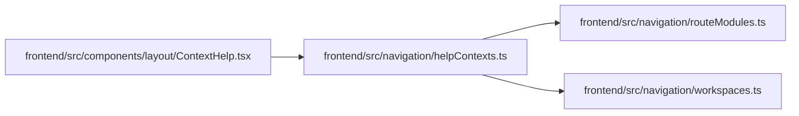

# helpContexts Module

**Path:** `frontend/src/navigation/helpContexts.ts`

## Description

_Auto-generated from `frontend/src/navigation/helpContexts.ts`._

## Imports

| Source | Symbols |
|--------|---------|
| `./routeModules` | `metadataForPath`, `RouteModuleKey` |
| `./workspaces` | `getWorkspaceForPath`, `PRIMARY_NAV_ITEMS` |

## Module Signals

| Signal | Values |
|--------|--------|
| Exports | `HelpContentProvider`, `HelpRelatedLink`, `getHelpContext` |
| Constants | `CONTENT_PROVIDER_BY_ROUTE`, `RELATED_PATHS_BY_ROUTE`, `SPECIAL_RELATED_LINKS` |

## Local dependency map

<!-- Auto-generated local dependency summary. Do not edit by hand. -->

### Internal neighbors

| Direction | Module |
|---|---|
| Inbound | [ContextHelp](../modules/ContextHelp.md) |
| Outbound | [routeModules](../modules/routeModules.md) |
| Outbound | [workspaces](../modules/workspaces.md) |

## Classes

| Class | Kind | Line | Bases / Target | Description |
|-------|------|------|----------------|-------------|
| [HelpContentProvider](../entities/HelpContentProvider.md) | Type alias | 10 | — | — |
| [HelpRelatedLink](../entities/HelpRelatedLink.md) | Type alias | 12 | — | — |

## Functions

| Function | Signature | Decorators | Description |
|----------|-----------|------------|-------------|
| `getHelpContext` | `(pathname: string)` | — | — |
