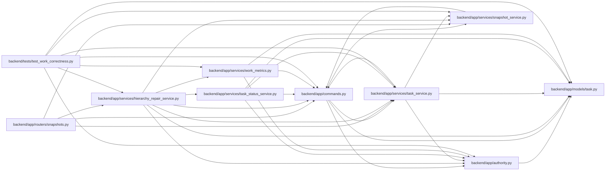

# hierarchy_repair_service Module

**Path:** `backend/app/services/hierarchy_repair_service.py`

## Description

Operator-scoped, bounded hierarchy diagnosis and version-checked deterministic repair.

## Imports

| Source | Symbols |
|--------|---------|
| `app.authority` | `require_operator` |
| `app.commands` | `atomic_command`, `lock_iterations` |
| `app.models.task` | `Task` |
| `app.services.snapshot_service` | `SnapshotService` |
| `app.services.task_service` | `TaskService` |
| `app.services.task_status_service` | `TaskStatusService` |
| `app.services.work_metrics` | `scoped_metric_tasks`, `task_signals` |
| `sqlalchemy` | `select` |

## Local dependency map

<!-- Auto-generated local dependency summary. Do not edit by hand. -->

### Internal neighbors

| Direction | Module |
|---|---|
| Inbound | [snapshots](../modules/snapshots.md) |
| Inbound | [test_work_correctness](../modules/test_work_correctness.md) |
| Outbound | [authority](../modules/authority.md) |
| Outbound | [commands](../modules/commands.md) |
| Outbound | [models_task](../modules/models_task.md) |
| Outbound | [snapshot_service](../modules/snapshot_service.md) |
| Outbound | [task_service](../modules/task_service.md) |
| Outbound | [task_status_service](../modules/task_status_service.md) |
| Outbound | [services_work_metrics](../modules/services_work_metrics.md) |

### External packages

| Language | Used packages | Undeclared packages |
|---|---:|---:|
| python | 1 | 0 |

## Classes

| Class | Line | Bases | Description |
|-------|------|-------|-------------|
| [HierarchyRepairService](../entities/HierarchyRepairService.md) | 14 | — | — |
