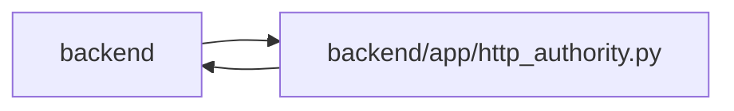

# http_authority Module

**Path:** `backend/app/http_authority.py`

## Description

Fail-closed HTTP identity resolution and explicit public capability boundaries.

Cookie, native bearer, actor, and operator credentials resolve to one principal; conflicting principals are rejected. Cookie writes require request integrity. Private task commands check permission before invoking services. Explicit public capabilities and the safe readiness response retain their separate policy. The backend defaults to managed mode and does not fall back to open collaboration when sign-in fails.

The restricted onboarding acknowledgement has a dedicated token-only boundary. Its existing exact handoff verifier validates the credential before binding integration authority; ambient cookies, bearer sessions, and operator headers cannot be mixed into that request.

## Imports

| Source | Symbols |
|--------|---------|
| `app.authority` | `Authority`, `AuthorityError`, `internal_authority`, `require_project` |
| `app.config` | `get_settings` |
| `app.database` | `get_db` |
| `app.models.identity` | `Principal`, `WorkspaceAuthorityState` |
| `app.models.task` | `Task` |
| `app.models.user_session` | `UserSession` |
| `app.security` | `admin_api_key_is_valid` |
| `app.services.agent_service` | `AgentService` |
| `app.services.identity_service` | `IdentityService`, `digest` |
| `app.services.session_service` | `_get_session_by_token` |
| `dataclasses` | `replace` |
| `fastapi` | `Depends`, `Request` |
| `secrets` | `secrets` |
| `sqlalchemy` | `select` |
| `typing` | `Annotated` |

## Local dependency map

<!-- Auto-generated local dependency summary. Do not edit by hand. -->

> Module-level dependencies exceed the generated-diagram limits, so the diagram and table below group them by top-level package. Counts report the number of module neighbors in each package.

### Internal neighbors

| Direction | Module |
|---|---|
| Inbound | `backend` (2) |
| Outbound | `backend` (10) |

### External packages

| Language | Used packages | Undeclared packages |
|---|---:|---:|
| python | 2 | 0 |

> All 12 module neighbor(s) are summarized by package because the module-level view exceeds the 12-node limit.

## Functions

| Function | Signature | Decorators | Description |
|----------|-----------|------------|-------------|
| `public_capability` | `(path, method)` | — | — |
| `resolve_http_identity` | *(async)* `(request, db)` | — | — |
| `enforce_http_authority` | *(async)* `(request: Request, db: Annotated[object, Depends(get_db, scope='function')])` | — | — |